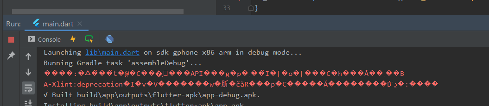
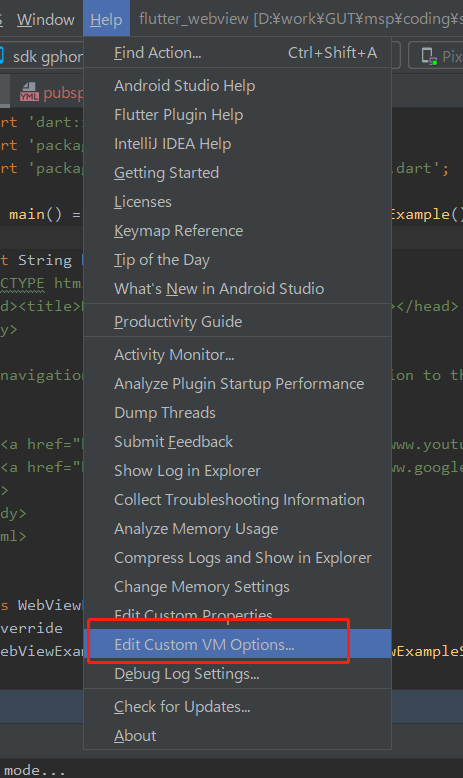
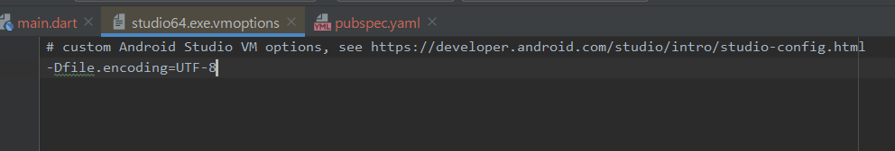

# Android StudioにおけるBuild Outputの文字化けを解消
## 状況

Windows10上のAndroid Studio 3.6.1でアプリを開発している。文字列やコメントに日本語を含むコードも問題なくビルド・実行できる。
しかしBuild Output Windowのエラーメッセージが文字化けして読めない。

## 解決方法

メニュー＞Help＞Edit Custom VM Options..」を選択する。

表示されたファイルに「-Dfile.encoding=UTF-8」を追加する。
文件不存在的话，点击yes 自动新建一个。

Android Studioを再起動すると、文字化けが解消した。

