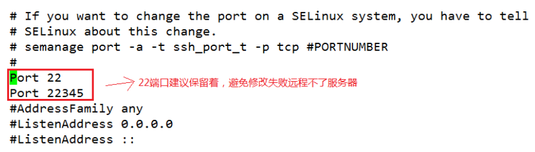
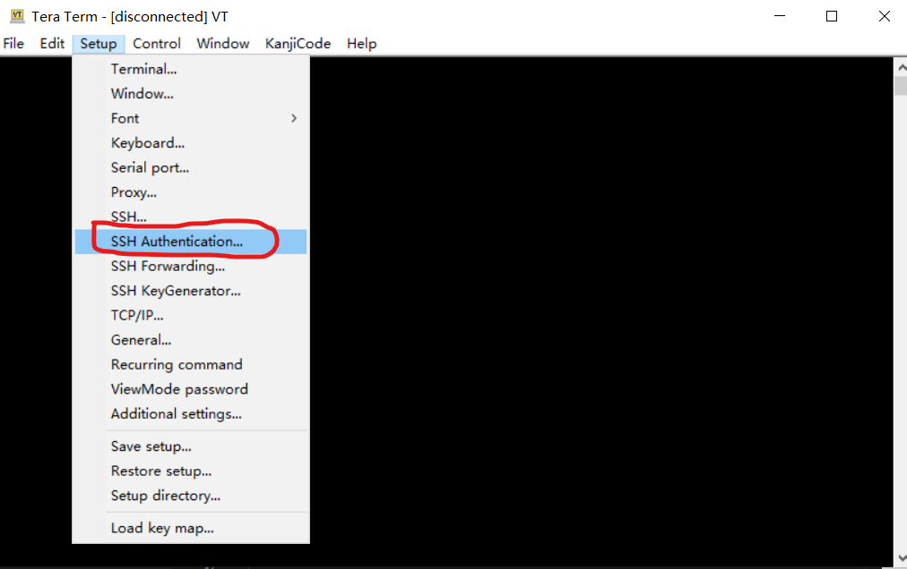

# 1. 禁止root用户直接登录

## 1.1 新建用户
```
useradd msp
passwd msp
# 设置或修改密码
```

## 1.2 测试用户连接
`ssh -p65000 msp@192.168.25.137`

## 1.2 修改sshd_config
`vi /etc/ssh/sshd_config`
查找 #PermitRootLogin yes” 默认为132行
将“#”去掉，末尾“Yes”改为“No”

## 1.3 重启sshd服务
systemctl restart sshd


# 2. 修改ssh的端口
1. 修改ssh配置文件sshd_config
   `vi /etc/ssh/sshd_config`
   删除掉Port 22前面的#，然后下一行输入新的端口号如：Port 65000（这个你自己定，最大不能超过65535）
   

2. 防火墙开放端口65000
   ```
   firewall-cmd --zone=public --add-port=22345/tcp --permanent
   firewall-cmd --reload
   ```
3. 重启 ssh 服务
  `systemctl restart sshd.service`

4. 测试 ssh新端口
   `ssh -p65000 root@192.168.25.137  `  
   如果成功的话，关闭端口22

5. 防火墙禁止端口22
   ```
   firewall-cmd --zone=public --add-port=22345/tcp --permanent
   firewall-cmd --reload
   ```
# 3. 禁止用户密码登录，通过秘钥登录

## 3.1 设置通过秘钥登录

### 3.1.1 设置linux服务器
1. 请先进入到 ~/.ssh 目录，不存在的话，请先创建

2. 生成秘钥
   `ssh-keygen -t rsa -b 4096 # 一路回车即可`
   默认生成到~/.ssh/
   root用户就在目录/root/.ssh/ 
   普通用户就是在/home/user1/.ssh/
   生成两个文件 公钥 id_rsa.pub
               私钥 id_rsa

3. 拷贝公钥给目标服务器方法1
   `ssh-copy-id -i id_rsa.pub –p 65000 user1@192.168.0.101`

3. 拷贝公钥给目标服务器方法2
   ```
   scp ~/.ssh/id_rsa.pub 192.168.0.101:~/.ssh/
   cat ~/.ssh/id_rsa.pub >> ~/.ssh/authorized_keys
   ```
4. 确认authorized_keys文件
    `cat /home/user1/.ssh/authorized_keys`

5. 将/.ssh/authorized_keys的权限设置为600
   `chmod 600 /home/user1/.ssh/authorized_keys`

6. 确认设置权限 （这是linux的安全要求，如果权限不对，自动登录将不会生效）
    ```
    ~/.ssh权限设置为700
    ~/.ssh/authorized_keys的权限设置为600
    ```

### 3.1.2 设置tera term免密登录
1. 设置私钥 



## 3.2 禁止用户密码登录

1. vi /etc/ssh/sshd_config
2. 将PasswordAuthentication参数值修改为no： 
   ```
    # 是否让 sshd 去检查用户家目录或相关档案的权限数据，
    # 这是为了担心使用者将某些重要档案的权限设错，可能会导致一些问题所致。
    # 例如使用者的 ~.ssh/ 权限设错时，某些特殊情况下会不许用户登入
    StrictModes no
    # 是否允许用户自行使用成对的密钥系统进行登入行为
    RSAAuthentication yes
    PubkeyAuthentication yes
    # 至于自制的公钥数据就放置于用户家目录下的 .ssh/authorized_keys 内
    AuthorizedKeysFile .ssh/authorized_keys

    # 有了证书登录了，就禁用密码登录吧，安全要紧
    PasswordAuthentication no
   ```
3. 重启ssh服务：
   `systemctl restart sshd.service`
