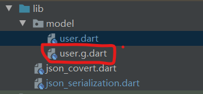
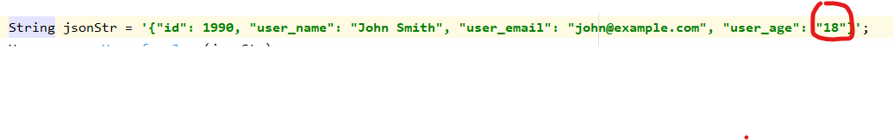

# JSON和序列化
如何在Flutter中使用JSON和map，以及model对象进行互换呢。

## 1. 将json字符串和Map互换
不需要额外的引用依赖包，系统内置的JSON解码器，就可以完成。

**只需引用系统包**

    `import 'dart:convert';`

在convert中声明了一个常量json对象用来进行转换。

    `const JsonCodec json = JsonCodec();`


参看以下的demo
```dart
import 'dart:convert';

/**
 *  系统提供了JSON类,这是一个简单的demo,用以将SON字符串和Map互换。
 *  JSON.decode方法来将JSON字符串转换为Map
 *  JSON.encode方法来将Map转换为JSON字符串
 */
class JsonMapDemo {
  static void json2map() {
    // JSON字符串转换为Map
    String jsonStr = '{"name": "John Smith", "email": "john@example.com"}';
    Map<String,dynamic> user = json.decode(jsonStr);
    print('user.name: ${user['name']}');
    print('user.email: ${user['email']}');

    // Map转换为JSON字符串
    user['name'] = 'huang';
    user['email'] = 'huang@demo.com';
    user['age'] = 18;
    String jsonStr2 = json.encode(user);
    print('json string: $jsonStr2');
  }
}
```
**缺点**

JSON.decode()仅返回一个Map<String, dynamic>，这意味着我们直到运行时才知道值的类型。 通过这种方法，我们失去了大部分静态类型语言特性：类型安全、自动补全和最重要的编译时异常。这样一来，我们的代码可能会变得非常容易出错。

例如，当我们访问name或email字段时，我们输入的很快，导致字段名打错了。但由于这个JSON在map结构中，所以所以编译时不会报错，这将导致返回一个null，这在后期找错的时候很不容易被发现。

改进上述的缺点，我们可以定义一个user model类。

## 2. 将json字符串和模型类互换

我们可以通过引入一个简单的模型类(model class)来解决前面提到的问题，我们称之为User。在User类内部，我们有：

* 一个User.fromJson 构造函数, 用于从一个map构造出一个 User实例 map structure
* 一个toJson 方法, 将 User 实例转化为一个map.
  
这样，调用user代码就可以具有类型安全、自动补全字段（name和email）以及编译时异常。如果我们将拼写错误或字段视为int类型而不是String， 那么我们的应用程序就不会通过编译，而不是在运行时崩溃。

**注**

那有人会说从一个map构造出一个 User实例时，不也会输错名字吗，但是这里输错了，只会修改只一个地方，如果用map的话，就会有的地方用错，用的地方用对。

demo
```dart
class User {
  String name;
  String email;
  int age;

  User(this.name, this.email, this.age);

  User.fromJson(Map<String, dynamic> json)
      : name = json['name'],
        email = json['email'],
        age = int.parse(json['age']);

  Map<String, dynamic> toJson() =>
      {
        'name': name,
        'email': email,
        'age': age,
      };
}

class JsonModelDemo {
  static void demo() {
    // JSON字符串转换为Map
    String jsonStr = '{"name": "John Smith", "email": "john@example.com", "age": "18"}';
    Map<String,dynamic> usermap = json.decode(jsonStr);
    User user = User.fromJson(usermap);
    print('user.name: ${user.name}');
    print('user.email: ${user.email}');
    print('user.age: ${user.age}');

    // Map转换为JSON字符串
    user.name = 'huang';
    user.email = 'huang@demo.com';
    user.age = 18;
    String jsonStr2 = json.encode(user.toJson());
    print('json string: $jsonStr2');
  }
}
```

**改善**

上述的User的fromJson，toJson方法是我们手写的，我们可以利用json_serializable package来自动生成这两个方法。

## 3. 利用json_serializable来自动生成model的json序列化代码

1. 添加依赖

我们需要添加三个依赖
* json_annotation -- 在代码中添加json注解用（例如 @JsonSerializable()）
* build_runner -- build_runner是dart团队提供的一个生成dart代码文件的外部包
* json_serializable -- 根据json注解生成model的json序列化代码

在pubspec.yaml中添加如下依赖

```dart

  dependencies:
    # json注解
    json_annotation: ^3.1.0

dev_dependencies:

  # 生成dart代码
  build_runner: ^1.10.3
  # 生成model的json序列化代码
  json_serializable: ^3.5.0

```

2. 手写model user类代码

```dart
import 'package:json_annotation/json_annotation.dart';
import 'dart:convert';

part 'user.g.dart';

@JsonSerializable()
class User {

  User(this.id);

  @JsonKey(nullable: false)
  final int id;
  @JsonKey(name: 'user_name')
  String userName;
  @JsonKey(name: 'user_email')
  String userEmail;
  @JsonKey(name: 'user_age')
  int userAge;

  // 反序列化 根据json字符串生成user对象
  factory User.fromJson(String jsonStr) {
      Map<String,dynamic> jsonMap = json.decode(jsonStr);
      return _$UserFromJson(jsonMap);
  }
  // 序列化 根据user对象生成序列化json字符串
  String toJson() {
    Map<String,dynamic> jsonMap = _$UserToJson(this);
    return json.encode(jsonMap);
  }
  
}

```

3. 运行命令生成代码

    在当前项目的根目录执行如下的命令

    `flutter packages pub run build_runner build`

就会生成 user.g.dart文件



4. 注意问题
   
4.1 flutter type 'int' is not a subtype of type 'String'
* 原因
  User model 类将age 定义为int。
  自动生成的user.g.dart 的age为 ..userAge = json['user_age'] as int;
  但是json字符串的age为字符串
  
* 解决办法
  将age字符串改为数字，也就是不加双引号
  `String jsonStr = '{"id": 1990, "user_name": "John Smith", "user_email": "john@example.com", "user_age": 18}';`
  或者 
  `..userAge = int.parse(json['user_age']);`


## 4. 嵌套json

## 5. 根据json文件生成model类
可以利用一下插件根据json文件生成model类和序列化代码
  * 利用FlutterJsonBeanFactory插件
  * 利用json2entity 

### 5.1  利用FlutterJsonBeanFactory插件

1. FlutterJsonBeanFactory插件的导入
   打开 adroid studio 的file --> setting --> plugin 安装FlutterJsonBeanFactory插件安装完后需要重启adroid studio
      

2. 为了可以将字符串类型转换为DateTime类型，需要导入intl，这是个类型转换tool
   `intl: ^0.16.1   `

3. 根据json语句生成model类及序列化代码
    在需要生成的目录上右键 new --> JsonToDartBeanAction
     

    在打开的窗口输入entity类名，和json字符串，点击make 自动生成
   

4. 生成的代码
   

  * /lib/generated/json/base/目录下生成 **最好要手动修改，每次会自动生成**
     JSONField类定义了@JSONField注解的属性
     JsonConvert类是所有entity的helper类，根据泛型，调用具体的entity helper类来进行序列化，反序列化
  * /lib/generated/json/  是entity helper类 **最好不要手动修改，每次会自动生成**
      有两个方法 
      1，将map --> entyty
      profileModelEntityFromJson(ProfileModelEntity data, Map<String, dynamic> json)
      2, 将entyty --> map 
      Map<String, dynamic> profileModelEntityToJson(ProfileModelEntity entity)
   
  * /lib/entity/目录下生成 entity类
    
5. 对应int，datime类型，再重新生成代码
   1. 我们将UserEntity类的 id 改为 int类型， birthday 改为 DateTime类型
   ```dart
   class UserEntity with JsonConvert<UserEntity> {
      int id;
      @JSONField(name: "user_name")
      String userName;
      String address;
      @JSONField(name: "partner_name")
      String partnerName;
      @JSONField(format: "yyyy/MM/dd hh:mm:ss",deserialize: true,serialize: true)
      DateTime birthday;
    }
   ```

  2. 选中  UserEntity文件 敲击 alt + j  重新生成代码
   


# 问题

关于modle继承，alt+j是不能自动生成的。