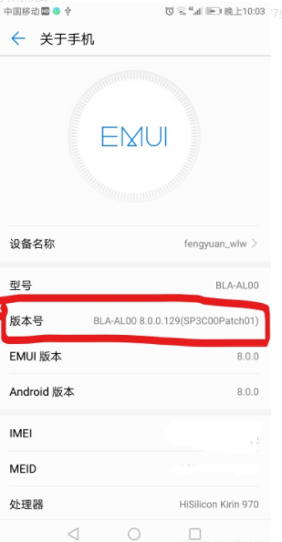
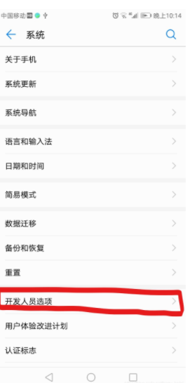
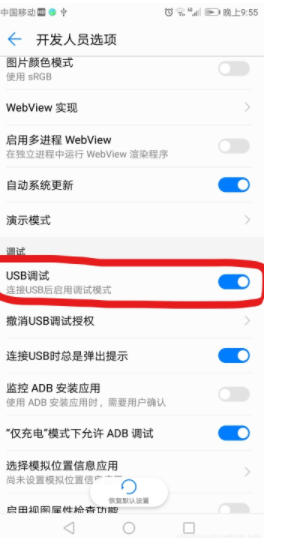
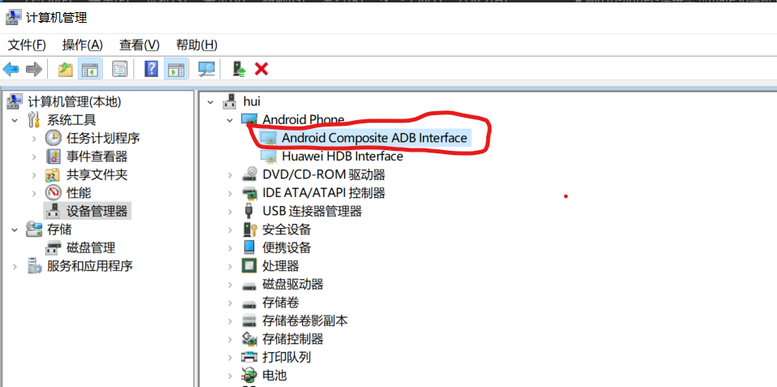
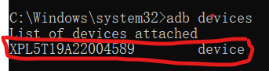
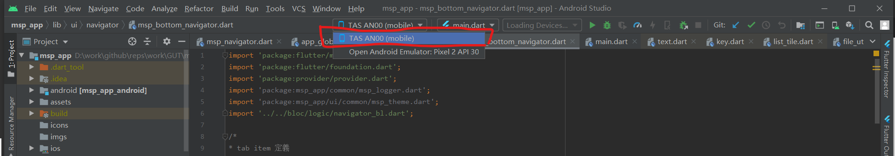

# 重点是一定要在手机中打开开发人员选项设置usb调试
否则android studio中一定不会连上手机

1. 打开手机的“设置”->“系统”->“关于手机”，快速点击下图中的“版本号”7到8次

    

2.  然后就可以在“设置”->“系统”->中看到 “开发人员选项”，如下图所示：（如果不执行操作1 是无法看到“开发人员选项”）

    

3. 打开USB调试功能
   打开“设置”->“系统”-> “开发人员选项”，设置usb调试为on

   

4. 插上USB线链接手机，打开pc的设备管理器进行确认
    插上USB线链接手机时，手机会有提示项，选择“传输文件”
   
    

6. 执行命令 adb devices，就会看到链接的设备
   
   

7. 在android studio中确认

      