# FCM （Firebase Cloud Messaging）
利用FCM可以向android 设备，iOS 设备，网页 (JavaScript) 客户端应用发送消息。

* 发送向用户显示的通知消息。 或者发送数据消息，
* 使用以下三种方式中的任意一种将消息分发到客户端应用：分发至单一设备、分发至设备组或分发至订阅了主题的设备。
* 从客户端应用将确认消息、聊天信息及其他消息从设备发回至您的服务器。

# FCM 架构概览

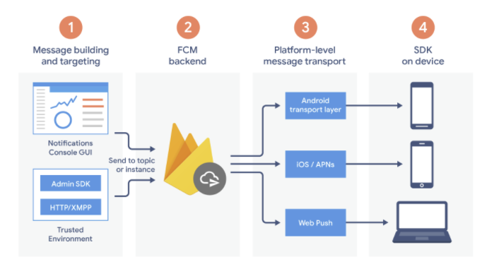

1. 用于编写或构建消息请求的工具。通知编辑器提供了一种基于 GUI 的用于创建通知请求的方式。 要实现对所有消息类型的完全自动化和支持，您必须在支持 Firebase Admin SDK 或 FCM 服务器协议的受信任服务器环境中构建消息请求。 此环境可以是 Cloud Functions for Firebase、Google App Engine 或您自己的应用服务器。
2. FCM 后端（以及其他函数），它接受消息请求，通过主题对消息执行扇出，并生成消息 ID 等消息元数据。也就是FCM的服务器端
3. 平台级传输层，用于将消息路由到目标设备、处理消息传送，并在适当情况下应用针对具体平台的配置。此传输层包括：
   * Android 传输层 (ATL)，适用于运行 Google Play 服务的 Android 设备
   * 适用于 iOS 设备的 Apple 推送通知服务 (APNs)
   * Web 应用的网络推送协议

4. 用户设备上的 FCM SDK，根据应用的前台/后台状态和任何相关应用逻辑显示通知或处理消息。如果你的应用转到后台，或者已经不在进程中，平台级传输层将用于唤醒你的应用，接受消息。

# 生命周期流
  * 注册设备以接收来自 FCM 的消息。客户端应用的实例注册以接收消息，并获取唯一标识应用实例的注册令牌。
  * 发送和接收下行消息。
    发送消息。应用服务器向客户端应用发送消息：
      1. 消息会在通知编辑器或受信任的环境中编写，并且消息请求会被发送到 FCM 后端。
      2. FCM 后端接收消息请求，生成消息 ID 和其他元数据，并将其发送到平台特定的传输层。
      3. 当设备在线时，系统会通过平台特定的传输层将消息发送到设备。
      4. 在设备上，客户端应用会接收到消息或通知。

  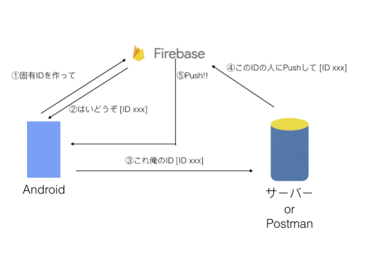

  <font color='red'>2019年4月11日にGCMは使えなくなるみたいなので，FCMを使おう。</font>

  上图的1，2 向firebase 发送ID不需要自己编程实现，有可能是FirebaseMessagingPlugin来完成的？

# FCM 消息
主要有两类消息，负载上限均为 4KB
* 通知消息，显示在手机的通知面板，有固定的格式，此类消息FCM SDK 可以识别，自动处理。
* 数据消息，显示在手机的通知栏中，由客户端应用自定义格式，由客户端应用负责解析处理。

1. 通知消息
   应用在后台运行时，通知消息将被传递至通知面板。应用在前台运行时，消息由回调函数处理。
   以下是 IM 应用中的 JSON 格式的通知消息。用户可能会在设备上看到标题为“来自星星的问候”、文本为“你有来自星星的快递，需要你接受一下。”的消息
   必须有的key "notification" FCM SDK 可以识别，可以显示在通知面板。
   可选的key "data" FCM SDK 不识别，只能由自己的应用程序处理。

   ```json
   {
      "message":{
        "token":"bk3RNwTe3H0:CI2k_HHwgIpoDKCIZvvDMExUdFQ3P1...",
        "notification":{
          "title":"来自星星的问候",
          "body":"你有来自星星的快递，需要你接受一下。"
        },
        "data":{
          "Nick" : "Mario",
          "body" : "great match!",
          "Room" : "PortugalVSDenmark"
        }
      }
    }
   ```

2. 数据消息
   定制化数据消息，只能由应用程序处理。
   ```json
   {
      "message":{
        "token":"bk3RNwTe3H0:CI2k_HHwgIpoDKCIZvvDMExUdFQ3P1...",
        "data":{
          "Nick" : "Mario",
          "body" : "great match!",
          "Room" : "PortugalVSDenmark"
        }
      }
    }
   ```
   

3. 跨平台消息
  面向所有平台（iOS、Android 和 Web）上的所有应用实例都可以解读以下通用字段：
     * message.notification.title
     * message.notification.body
     * message.data

# 实现流程

1. 事前准备 -- 需要在[Firebase网站](https://firebase.google.com/)注册一个用户，和至少新建一个项目.
2. 设置 FCM SDK -- 在应用上(android，iOS，网页 (JavaScript)应用 )设置 Firebase 和 FCM. 
3. 开发客户端应用 -- 客户端应用添加消息处理、主题订阅逻辑或其他可选功能。
4. 开发应用服务器 -- 使用 Firebase Admin SDK 还是某种服务器协议来创建发送逻辑，这些逻辑将用于身份验证、构建发送请求、处理响应等等。

## 1.  事前准备
登录[FCM网站](https://firebase.google.com/)注册一个用户,登录。
1. 追加一个项目
  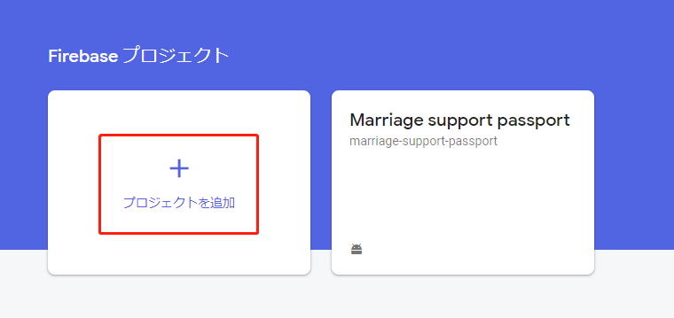

2. 填写项目名
  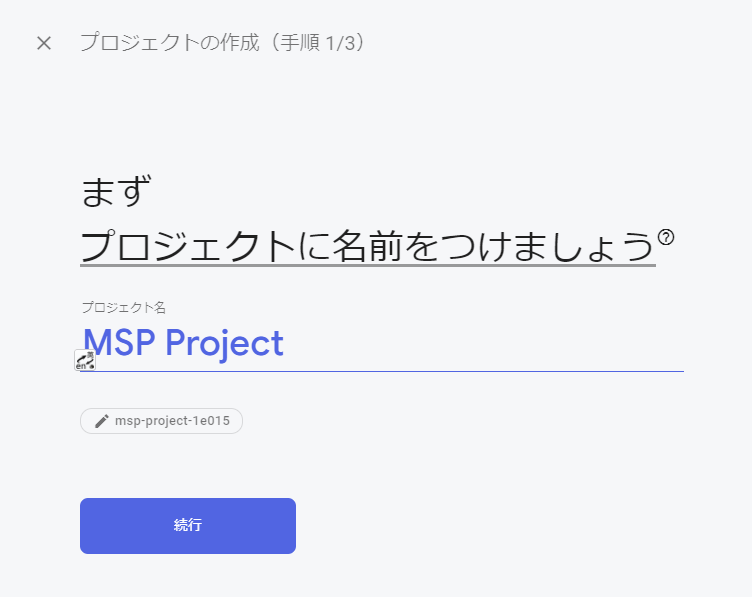

3. 可以选择统计分析服务 firebase Analytics （用于分析的可以不设置）
  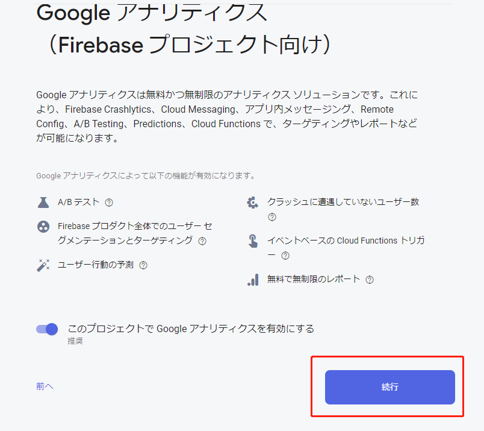

4. 选择Analytics account （用于分析的可以不设置）
  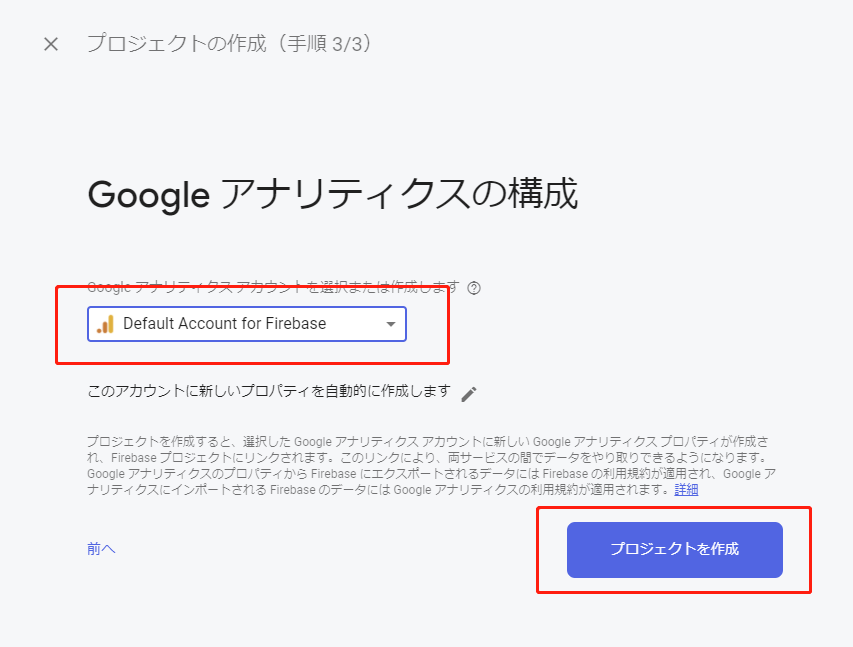

5. 项目作成中
  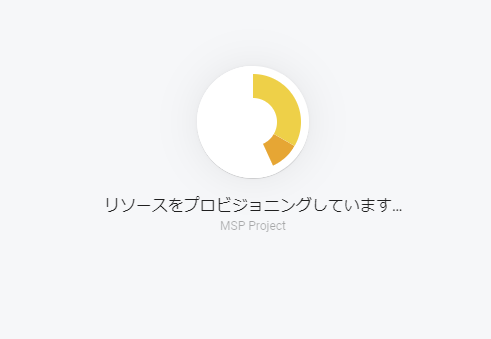

6. 项目作成完成
  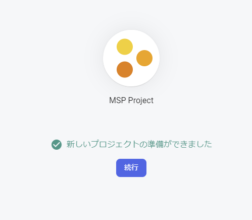

7. 追加一种（ios，android，web）app
  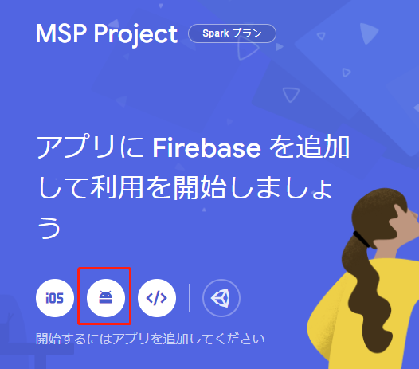

8. 登录app package 名
  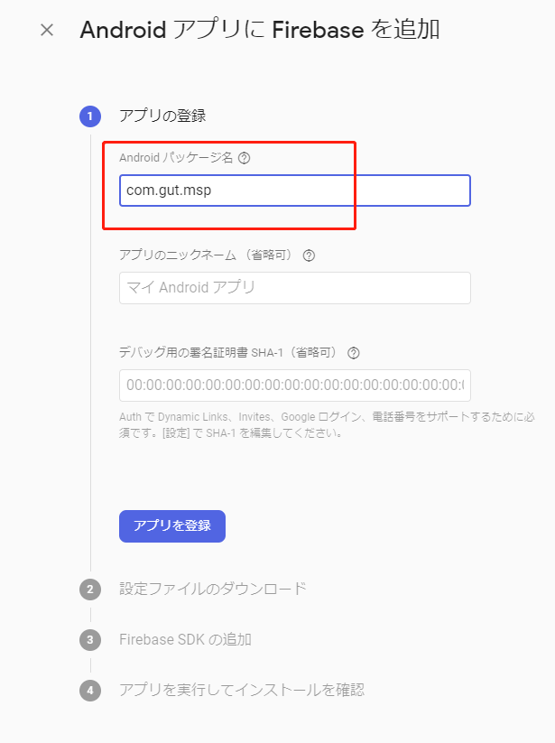
  nick name, 署名证明书，是可选的，不是必填的。

9.  google-services.json download
  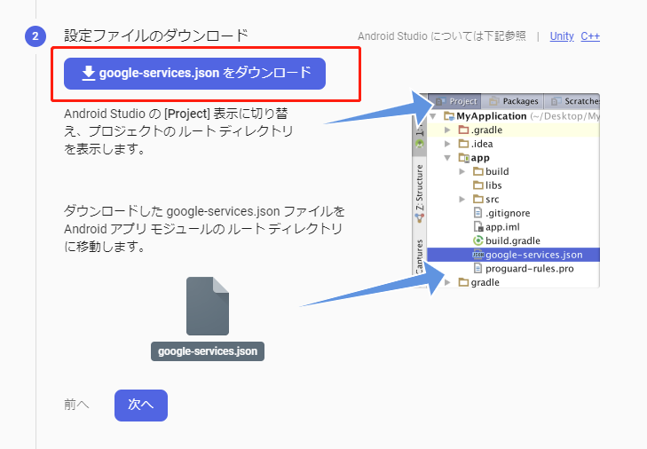
  
10.  项目概要
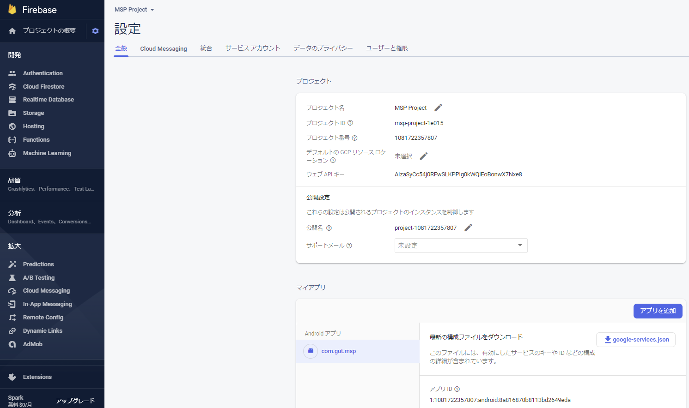

## 2. android 设置 FCM SDK 

1. 配置 google-services.json 到flutter 项目中
   google-services.json文件参照 1. 事前准备的9. google-services.json download
   把下载完的 google-services.json 放置在<Flutterプロジェクト>/android/app下
   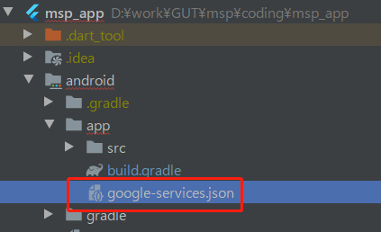

2. 将 Google 服务插件添加到 Gradle 文件中   
  a. 在根级（项目级）Gradle 文件 (<Flutterプロジェクト>/android/build.gradle) 中添加google-services
    ```dart
    dependencies {
      // google-servicesへのクラスパスを追記
      classpath 'com.google.gms:google-services:4.3.4'
    }
    ```
    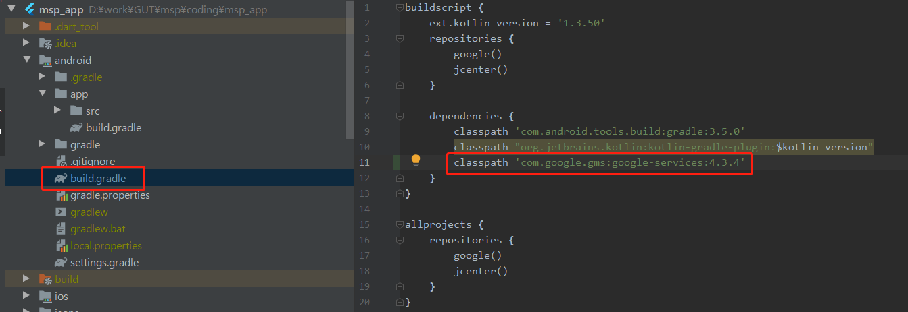
  
   b. 在模块（应用级）Gradle 文件（通常是 /android/app/build.gradle）中，添加 Google 服务 Gradle 插件
   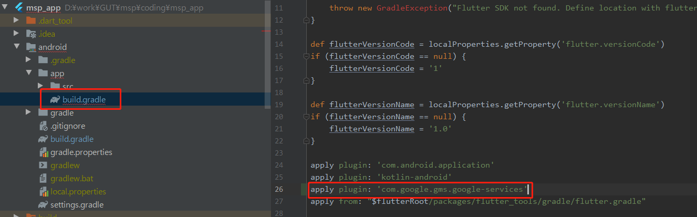   

3. 添加 Firebase SDK
  在模块（应用级）Gradle 文件（通常是 /android/app/build.gradle）中，添加要在应用中使用的 Firebase 产品的依赖项。
  
    ```dart
    dependencies {
      // ...
      implementation 'com.google.firebase:firebase-messaging:<最新バージョン>'
    }
    ```
    上記<最新バージョン>部分には、 [Firebase Android リリースノート](https://firebase.google.com/support/release-notes/android#latest_sdk_versions)よりCloudMessaging(クラウドメッセージング)最新バージョンを調べて記載します。

    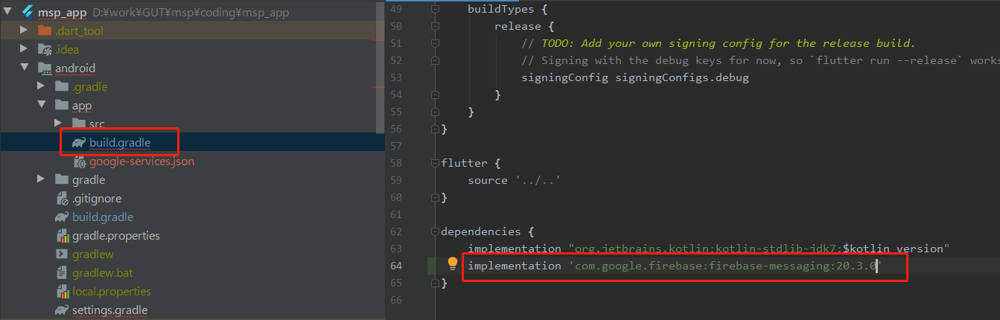

4. 修改 applicationId
   在模块（应用级）Gradle 文件（通常是 /android/app/build.gradle）中修改applicationId
   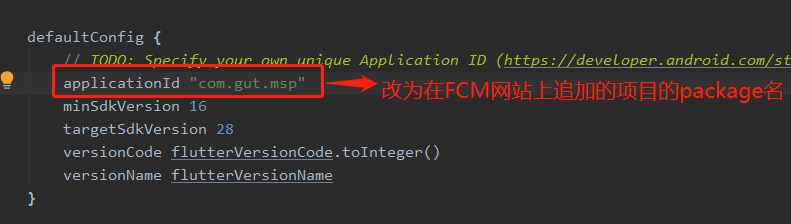

5. 修改您的应用清单文件/android/app/src/main/AndroidManifest.xml(flutter 项目)
    * onResume、onLaunch的設定
       ユーザがシステムトレイへ届いた通知をクリックした時、アプリ内でonResumeやonLaunchで通知を受けたいなら、次を<Flutterプロジェクト>/android/app/src/main/AndroidManifest.xmlの<activity>に追記します。

      ```dart
      <intent-filter>
          <action android:name="FLUTTER_NOTIFICATION_CLICK" />
          <category android:name="android.intent.category.DEFAULT" />
      </intent-filter>
      ```
      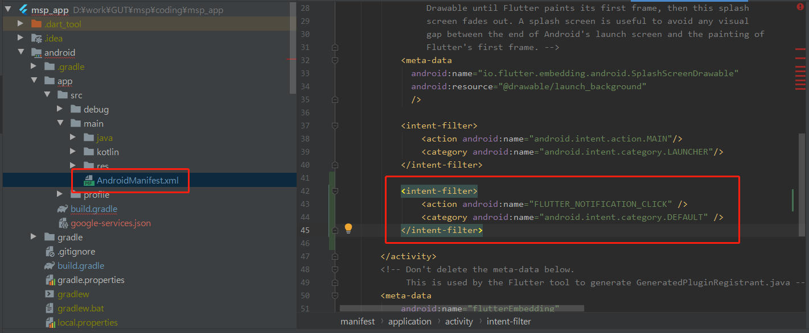

6. 修改您的应用清单文件/android/app/src/main/AndroidManifest.xml(android 项目)
   
   * 一项继承 FirebaseMessagingService 的服务。在后台应用中，如果除了接收通知外，您还希望进行任何消息处理，则必须添加此服务。如需在前台应用中接收通知、接收数据负载以及发送上行消息等，您必须继承此服务。
     <font color='red'>flutter项目不需要此配置</font>
    
        ```xml
            <service
              android:name=".java.MyFirebaseMessagingService"
              android:exported="false">
              <intent-filter>
                  <action android:name="com.google.firebase.MESSAGING_EVENT" />
              </intent-filter>
            </service>
          </application>
        ```
   * （可选）应用组件中用于设置默认通知图标和颜色的元数据元素。如果传入的消息未明确设置图标和颜色，Android 就会使用这些值。
      ```xml 
        <!-- Set custom default icon. This is used when no icon is set for incoming notification messages.
      See README(https://goo.gl/l4GJaQ) for more. -->
        <meta-data
            android:name="com.google.firebase.messaging.default_notification_icon"
            android:resource="@drawable/ic_stat_ic_notification" />
        <!-- Set color used with incoming notification messages. This is used when no color is set for the incoming
            notification message. See README(https://goo.gl/6BKBk7) for more. -->
        <meta-data
            android:name="com.google.firebase.messaging.default_notification_color"
            android:resource="@color/colorAccent" />
      ```

   * 可选）对于 Android 8.0（API 级别 26）和更高版本，我们支持并推荐使用通知渠道。FCM 提供具有基本设置的默认通知渠道。如果您希望创建和使用自己的默认渠道，请将 default_notification_channel_id 设置为您的通知渠道对象的 ID（如下所示）；只要传入的消息未明确设置通知渠道，FCM 就会使用此值。
      ```xml 
        <meta-data
          android:name="com.google.firebase.messaging.default_notification_channel_id"
          android:value="@string/default_notification_channel_id" />

      ```

## 3. ios app 利用 firebase message所需要的设置

实际上FCM的firebase需要利用 apple的APNs服务(Apple Push Notification サービス) 所以需要在apple developer网站，Firebase Console，xcode上做以下设定

### 1. 在[apple developer网站](https://developer.apple.com/account) 作成 apn service key
  
   

   

   

   下载 key文件 后面用到
   

### 2. 使用 Firebase Console 追加一个 iOS app 到你的项目中
  　
  为了得到　GoogleService-Info.plist 

   

   选择ios
   

   

   GoogleService-Info.plist ファイルダウンロード
   

   flutter项目不需要设置 Firebase SDK の追加 和 初期化コードの追加
   


### 3. 设置xcode

 **In the Capabilities Tab**
 
 1. add push notifications
    
    
 2. add background Modes
    
    选中Background fetch and Remote notifications 
    

### 4. 使用 Firebase Console 上传 APNs 認証キー
  1. 选择 Project的Cloud Messaging
   
     

  2. 上传 APNS key
     

     

     

### 5. 修改ios source

add the following to your application's Info.plist file

```
<key>FirebaseAppDelegateProxyEnabled</key>
<false/>
```

add the to AppDelegate.swift

```
/* Google firebase message 設定 */
if #available(iOS 10.0, *) {
  UNUserNotificationCenter.current().delegate = self as? UNUserNotificationCenterDelegate
}
```


###　6．问题
1. GoogleService-Info.plist 并没有加到 xcode项目中
   
   手动加入
   

   

2. debug mode 可以接受消息，release mode 不能接受消息
   修改Info.plist
   ```
   <key>FirebaseAppDelegateProxyEnabled</key>
    <false/>
   ```
   -->
   ```
   <key>FirebaseAppDelegateProxyEnabled</key>
    <string>0</string>
   ```
   ios 版本 > 12.1
   
   还有可能就是，因为重新安装新的版本，或者卸载再安装以前注册的fcm token失效了。可以单独给这个token发消息，会收到 results":[{"error":"NotRegistered"}]}

3. NotRegistered 错误
   
   执行
   ```
   curl -H "Authorization: key=AAAA-DWF064:APA91bE1HDA3PGOBuVv7uZBioGCEsvxrhykGh-1UfSwhJgBbgt6a2pWw1MjRGmNK5lWBzBIctf4gl7-uk6vBRr9omqeGNBrrxJ36zjCPXh3Sr380VBqI6pyxVRf98e9JXsYzzX3Janxl" -H "Content-Type: application/json" -d @test2.json  https://fcm.googleapis.com/fcm/send
   ```

   结果
  ```   
  {"multicast_id":2555524267543714434,"success":0,"failure":1,"canonical_ids":0,"results":[{"error":"NotRegistered"}]}
  ```

  原因
  因为重新安装新的版本，或者卸载再安装，以前注册的fcm token就失效了。

  解决办法
  追加 onTokenRefresh事件的监听
  ```
  _firebaseMessaging.onTokenRefresh.listen((token) {
    updateFcmToken(token);
  });
  ``` 
    
## 4. 开发客户端应用

  1. 追加Application.java文件
      Add an Application.java class to your app in the same directory as your MainActivity.java. 

      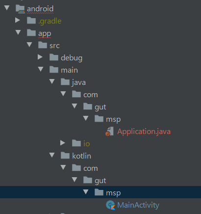

      ```java
        package com.gut.msp;

        import io.flutter.app.FlutterApplication;
        import io.flutter.plugin.common.PluginRegistry;
        import io.flutter.plugin.common.PluginRegistry.PluginRegistrantCallback;
        import io.flutter.plugins.GeneratedPluginRegistrant;
        import io.flutter.plugins.firebasemessaging.FlutterFirebaseMessagingService;
        import io.flutter.plugins.firebasemessaging.FirebaseMessagingPlugin;

        public class Application extends FlutterApplication implements PluginRegistrantCallback {
            @Override
            public void onCreate() {
                super.onCreate();
                FlutterFirebaseMessagingService.setPluginRegistrant(this);
            }

            @Override
            public void registerWith(PluginRegistry registry) {
        //        GeneratedPluginRegistrant.registerWith(registry);
                FirebaseMessagingPlugin.registerWith(registry.registrarFor("io.flutter.plugins.firebasemessaging.FirebaseMessagingPlugin"));
            }
        }
      ```
  2. 修改 application的android:name
     修改应用清单文件/android/app/src/main/AndroidManifest.xml
     将
      ```dart
      <application
          android:name="io.flutter.app.FlutterApplication"
          android:label="msp_app"
          android:icon="@mipmap/ic_launcher">
      ```
      修改为
      ```dart
      <application
          android:name=".Application"
          android:label="msp_app"
          android:icon="@mipmap/ic_launcher">
      ```
     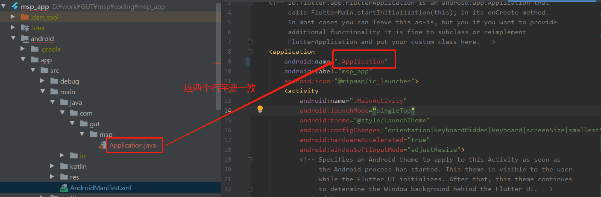

  3. plugin firebase_messaging 7.0.3的引入
   
      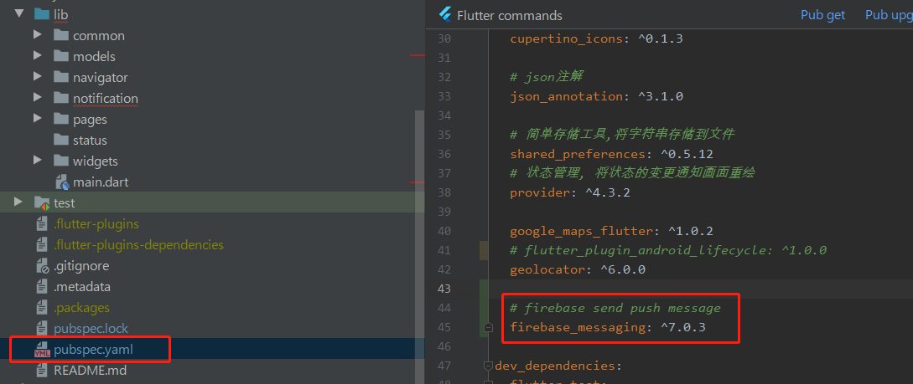

1. 实装接受message程序
  ```dart
    import 'package:flutter/material.dart';
    import 'package:firebase_messaging/firebase_messaging.dart';

    class HomePage extends StatefulWidget {
      @override
      State<HomePage> createState() => HomeState();
    }

    class HomeState extends State<HomePage> {

      final FirebaseMessaging _firebaseMessaging = new FirebaseMessaging();

      @override
      void initState() {
        super.initState();
        _initFireMessage();
      }

      @override
      Widget build(BuildContext context) {
        return Scaffold(
          body: Center(
            child:  Column(
              mainAxisSize: MainAxisSize.min,
              children: <Widget>[
                Text(
                  'Index 0: Home',
                ),
                RaisedButton(
                  onPressed: (){
                    // 获取fire message token
                    if(_firebaseMessaging != null) {
                      _firebaseMessaging.getToken().then((value) => print('fire token: "$value"'));
                    } else {
                      print('firebaseMessaging is null');
                    }

                  },
                  child: const Text('get token', style: TextStyle(fontSize: 20)),
                ),
                const SizedBox(height: 30),
              ],
            ),

          ),
        );
      }

      /**
      * firebaseMessage处理
      */
      _initFireMessage() {
        _firebaseMessaging.configure(
          // 接受消息处理
          onMessage: (Map<String, dynamic> message) async {
            print("onMessage: $message");
            _buildDialog(context, "onMessage");
          },
          // 点击消息通知面板启动程序时处理
          onLaunch: (Map<String, dynamic> message) async {
            print("onLaunch: $message");
            _buildDialog(context, "onLaunch");
          },
          // 点击消息通知面板，从后台恢复程序时处理
          onResume: (Map<String, dynamic> message) async {
            print("onResume: $message");
            _buildDialog(context, "onResume");
          },
        );
        _firebaseMessaging.requestNotificationPermissions(
            const IosNotificationSettings(sound: true, badge: true, alert: true));
        _firebaseMessaging.onIosSettingsRegistered
            .listen((IosNotificationSettings settings) {
          print("Settings registered: $settings");
        });
        _firebaseMessaging.getToken().then((String token) {
          assert(token != null);
          print("Push Messaging token: $token");
        });
        _firebaseMessaging.subscribeToTopic("/topics/all");
      }

      // ダイアログを表示するメソッド
      void _buildDialog(BuildContext context, String message) {
        showDialog(
            context: context,
            barrierDismissible: false,
            builder: (BuildContext context) {
              return new AlertDialog(
                content: new Text("Message: $message"),
                actions: <Widget>[
                  new FlatButton(
                    child: const Text('CLOSE'),
                    onPressed: () {
                      Navigator.pop(context, false);
                    },
                  ),
                  new FlatButton(
                    child: const Text('SHOW'),
                    onPressed: () {
                      Navigator.pop(context, true);
                    },
                  ),
                ],
              );
            }
        );
      }

    }
  ```

## 5. 向手机发送消息
  1. 利用firebase console
  点击 app的getToken 按钮
    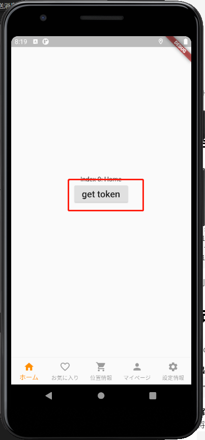
  查看 token 
    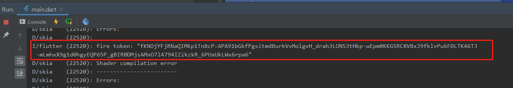  
  点击 左侧菜单的 cloud messaging
    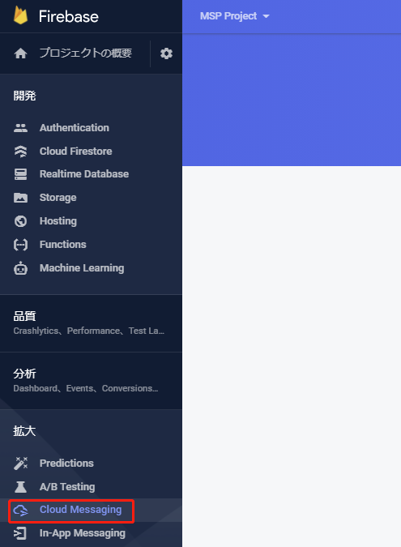
  点击 send your first message
    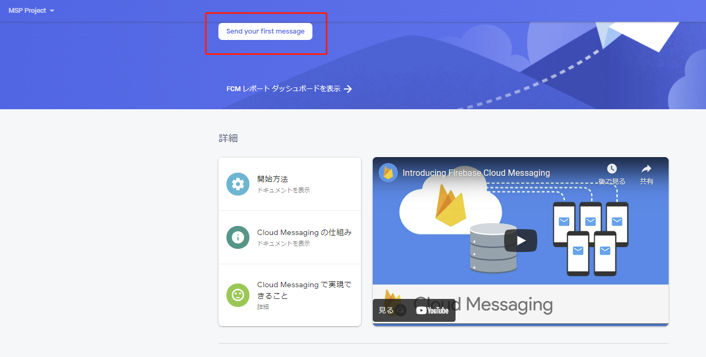
  输入 title，body， 点击 message 送信
    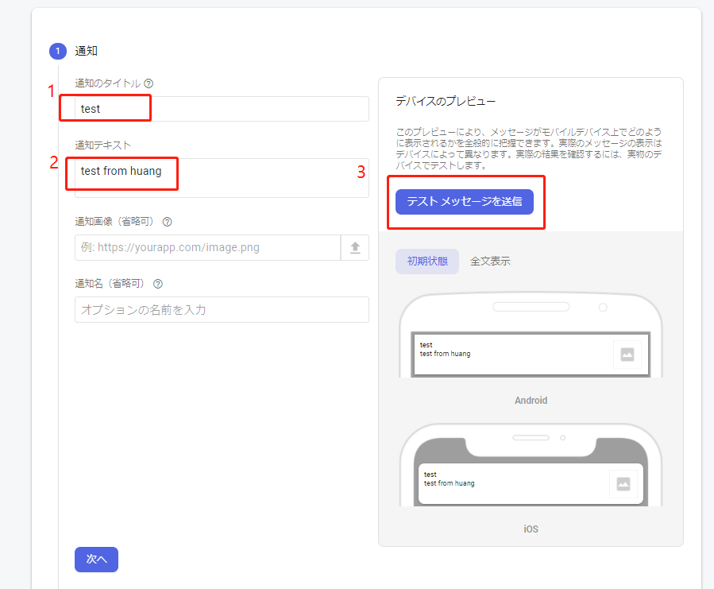
  追加客户端token
  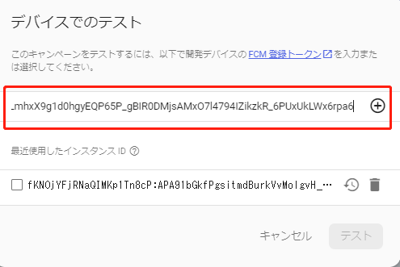
  选中客户端token,点击发送
  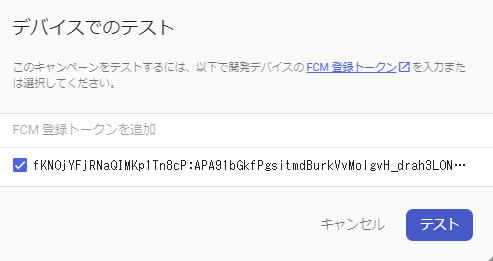
  app 显示
  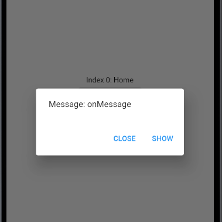
  通知面板显示
  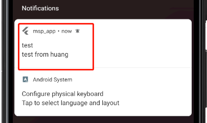

  2. 利用curl 命令发送
      ```
      curl -H "Authorization: key=AAAA-9utSC8:APA91bH99MAvqMb2NmEJfTa1zcufcK-IF8R-Qjy_yEJFgq97BV0ijD7FXqnyvHig0md4I8Bpv2ql6rhXjs-_NieHEi3RPFIkTSGFQD9fggYrIK-dfuXlGZUp-leGU6-JFBkvA6JvITyc" -H "Content-Type: application/json" -d @test.json  https://fcm.googleapis.com/fcm/send
      ```
      以key=AAAA-9utSC8。。。6JvITyc 部分是server key
      server key在那里看呢
      在 fire console 点击菜单的设定
      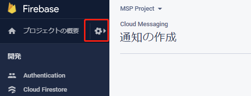  
      然后点击 cloud Messaging就可以看到了
      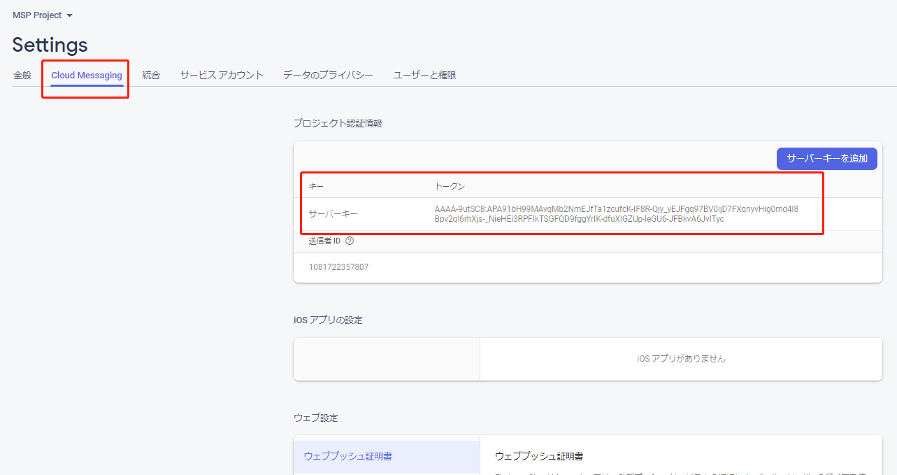

      test.json文件
      ```
      {
          "to": "/topics/all",
          "priority": "high",
          "notification" : {
              "title" : "テスト Title",
              "body" : "テスト Body"
          },
          "data" : {
              "id" : "1001",
              "message" : "message 文字列",
              "metadata" : "metadata 文字列",
              "click_action": "FLUTTER_NOTIFICATION_CLICK"
          }
      }
      ```


# 有可能遇到的问题

1. incompatible types: PluginRegistry 
* **出错信息**
  ```
  "error: incompatible types: PluginRegistry cannot be converted to FlutterEngine GeneratedPluginRegistrant.registerWith (registry); " 
  ``` 
* **解决办法**
  将
  ```  java
    @Override
      public void registerWith(PluginRegistry registry) {
          GeneratedPluginRegistrant.registerWith(registry); 
      }

  ```
  改为
    ```  java
    @Override
      public void registerWith(PluginRegistry registry) {
          FirebaseMessagingPlugin.registerWith(registry.registrarFor("io.flutter.plugins.firebasemessaging.FirebaseMessagingPlugin"));
      }

  ```
  完整代码
  ```java
    package com.gut.msp;

  import io.flutter.app.FlutterApplication;
  import io.flutter.plugin.common.PluginRegistry;
  import io.flutter.plugin.common.PluginRegistry.PluginRegistrantCallback;
  import io.flutter.plugins.GeneratedPluginRegistrant;
  import io.flutter.plugins.firebasemessaging.FlutterFirebaseMessagingService;
  import io.flutter.plugins.firebasemessaging.FirebaseMessagingPlugin;

  public class Application extends FlutterApplication implements PluginRegistrantCallback {
      @Override
      public void onCreate() {
          super.onCreate();
          FlutterFirebaseMessagingService.setPluginRegistrant(this);
      }

      @Override
      public void registerWith(PluginRegistry registry) {
          // 会引起错误，改为下面的注册方法 
          // "error: incompatible types: PluginRegistry cannot be converted to FlutterEngine GeneratedPluginRegistrant.registerWith (registry); "
          // GeneratedPluginRegistrant.registerWith(registry); 
          FirebaseMessagingPlugin.registerWith(registry.registrarFor("io.flutter.plugins.firebasemessaging.FirebaseMessagingPlugin"));
      }
  }
  ```
2. PluginRegistrantCallback is not set
* **出错信息**
  ```
  Fatal Exception: java.lang.RuntimeException
  Unable to create service io.flutter.plugins.firebasemessaging.FlutterFirebaseMessagingService: 
  java.lang.RuntimeException: PluginRegistrantCallback is not set.
  ```
* **解决办法**
修改AndroidManifest.xml文件的android:name
将
`android:name="io.flutter.app.FlutterApplication"`
改为
`android:name=".Application"`


# 管理通知渠道？？

[参照管理通知渠道](https://developer.android.com/guide/topics/ui/notifiers/notifications.html?authuser=0#ManageChannels)

