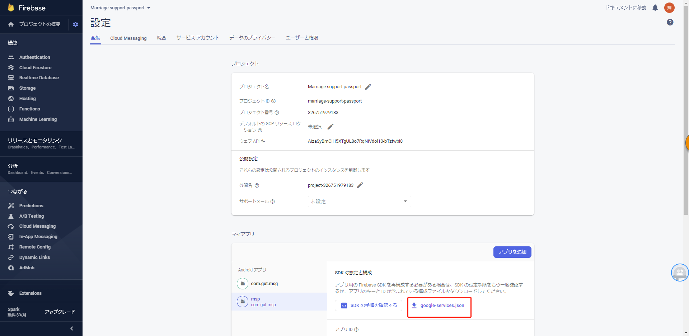

#　FCMを利用して、送受信開発流れ

#　1．serverでメッセージ送信開発
    メッセージは、Firebase Admin SDK を介して送信する
    JavaバージョンのFirebase Admin SDK を利用して、アプリサーバーを開発する
    Admin FCM API 可处理后端身份验证工作，同时便于发送消息和管理主题订阅。
    使用 Firebase Admin SDK，您可以执行以下操作：
    - 向个别设备发送消息
    - 向主题和与一个或多个主题匹配的条件语句发送消息。
    - 为设备订阅和退订主题
    - 针对不同目标平台构建量身定制的消息负载。
    
* [api ドキュメント](https://firebase.google.com/docs/reference/admin/java/reference/com/google/firebase/messaging/package-summary?authuser=0 )
* [FCM HTTP v1 API プロトコル](https://firebase.google.com/docs/reference/fcm/rest/v1/projects.messages?authuser=0)

## 1.1 Java　Firebase Admin SDK　導入

1. dependency導入
``` java
<dependency>
  <groupId>com.google.firebase</groupId>
  <artifactId>firebase-admin</artifactId>
  <version>7.0.1</version>
</dependency>
```
2. JSON 格式的私钥文件的导入



3. 设置私钥文件环境变量
```
export GOOGLE_APPLICATION_CREDENTIALS="/home/user/Downloads/service-account-on-file.json"
```
完成上述步骤后，应用默认凭据 (ADC) 能够隐式确定您的凭据，如此您便能在非 Google 环境中测试或运行时使用服务帐号凭据

## 1.2 Java　授权访问

1. 初始化 SDK java 代码
```java
// 在不使用参数的情况下进行初始化，该SDK使用 Google 应用默认凭据
FirebaseApp.initializeApp();

```
或者 使用凭据来创建访问令牌
```java
private static String getAccessToken() throws IOException {
  GoogleCredential googleCredential = GoogleCredential
      .fromStream(new FileInputStream("service-account.json"))
      .createScoped(Arrays.asList(SCOPES));
  // 在您的访问令牌到期后，系统会自动调用令牌刷新方法以检索更新的访问令牌
  googleCredential.refreshToken();
  return googleCredential.getAccessToken();
}

```
2. 如需将访问令牌添加到 HTTP 请求标头中，请执行以下操作
```java
    URL url = new URL(BASE_URL + FCM_SEND_ENDPOINT);
    HttpURLConnection httpURLConnection = (HttpURLConnection) url.openConnection();
    httpURLConnection.setRequestProperty("Authorization", "Bearer " + getAccessToken());
    httpURLConnection.setRequestProperty("Content-Type", "application/json; UTF-8");
    return httpURLConnection;
}

```

3. 检查服务器密钥的有效性。例如，在 Linux 上运行以下命令：
```shell

api_key=YOUR_SERVER_KEY

curl --header "Authorization: key=$api_key" \
     --header Content-Type:"application/json" \
     https://fcm.googleapis.com/fcm/send \
     -d "{\"registration_ids\":[\"ABC\"]}"

```

## 1.3 Java　构建应用服务器发送请求
使用 Firebase Admin SDK 或 FCM 应用服务器协议，您可以构建消息请求并将其发送到以下各类目标：

* 主题名称
* 条件
* 设备注册令牌
* 设备组名称（仅限旧版协议或 Node.js 版 Firebase Admin SDK）
您可以发送包含通知载荷（由预定义字段组成）的消息、包含数据载荷（由您自己的用户定义字段组成）的消息，或者包含这两种载荷的消息。

### 1.3.1 向特定设备发送消息
  ```java
  // This registration token comes from the client FCM SDKs.
    String registrationToken = "YOUR_REGISTRATION_TOKEN";

    // See documentation on defining a message payload.
    Message message = Message.builder()
        .putData("score", "850")
        .putData("time", "2:45")
        .setToken(registrationToken)
        .build();

    // Send a message to the device corresponding to the provided
    // registration token.
    String response = FirebaseMessaging.getInstance().send(message);
    // Response is a message ID string.
    System.out.println("Successfully sent message: " + response);FirebaseMessagingSnippets.java
  ```

### 1.3.2 向多台设备发送消息
  借助 REST API 与 Admin FCM API，您可以将消息多播到一系列设备注册令牌。每次调用时，您最多可以指定 **100** 个设备注册令牌（**对于 Java 和 Node.js，最多可以指定 500 个**）。

  ```java
  // Create a list containing up to 500 registration tokens.
    // These registration tokens come from the client FCM SDKs.
    List<String> registrationTokens = Arrays.asList(
        "YOUR_REGISTRATION_TOKEN_1",
        // ...
        "YOUR_REGISTRATION_TOKEN_n"
    );

    MulticastMessage message = MulticastMessage.builder()
        .putData("score", "850")
        .putData("time", "2:45")
        .addAllTokens(registrationTokens)
        .build();
    BatchResponse response = FirebaseMessaging.getInstance().sendMulticast(message);
    // See the BatchResponse reference documentation
    // for the contents of response.
    System.out.println(response.getSuccessCount() + " messages were sent successfully");FirebaseMessagingSnippets.java
  ```

### 1.3.3 向主题发送消息
  借助 REST API 与 Admin FCM API，您可以将消息多播到一系列设备注册令牌。每次调用时，您最多可以指定 **100** 个设备注册令牌（**对于 Java 和 Node.js，最多可以指定 500 个**）。
    ```java
    // The topic name can be optionally prefixed with "/topics/".
    String topic = "highScores";

    // See documentation on defining a message payload.
    Message message = Message.builder()
        .putData("score", "850")
        .putData("time", "2:45")
        .setTopic(topic)
        .build();

    // Send a message to the devices subscribed to the provided topic.
    String response = FirebaseMessaging.getInstance().send(message);
    // Response is a message ID string.
    System.out.println("Successfully sent message: " + response);FirebaseMessagingSnippets.java
    ``` 
    **或者根据条件发送消息**
    如需向主题组合发送消息，请指定一个条件，该条件是一个指定目标主题的布尔表达式。例如，如需向已订阅 TopicA 和 TopicB 或 TopicC 的设备发送消息，请设置如下条件：
    `'TopicA' in topics && ('TopicB' in topics || 'TopicC' in topics)`
    FCM 首先对括号中的所有条件求值，然后从左至右对表达式求值。在上述表达式中，只订阅某个单一主题的用户将不会接收到消息。同样地，未订阅 TopicA 的用户也不会接收到消息。下列组合将会接收到消息：

    TopicA 和 TopicB
    TopicA 和 TopicC
    您最多可以在条件表达式中添加五个主题。
    ```java
    // Define a condition which will send to devices which are subscribed
    // to either the Google stock or the tech industry topics.
    String condition = "'stock-GOOG' in topics || 'industry-tech' in topics";

    // See documentation on defining a message payload.
    Message message = Message.builder()
        .setNotification(Notification.builder()
            .setTitle("$GOOG up 1.43% on the day")
            .setBody("$GOOG gained 11.80 points to close at 835.67, up 1.43% on the day.")
            .build())
        .setCondition(condition)
        .build();

    // Send a message to devices subscribed to the combination of topics
    // specified by the provided condition.
    String response = FirebaseMessaging.getInstance().send(message);
    // Response is a message ID string.
    System.out.println("Successfully sent message: " + response);FirebaseMessagingSnippets.java
    ``` 

## 1.4 服务器管理主题
借助 Firebase Admin SDK，您可以从服务器端执行基本的主题管理任务。如果有客户端应用实例的注册令牌，您还可以使用服务器逻辑批量订阅和退订这些实例。

您可以为客户端应用实例订阅任何现有主题，也可创建新主题。当您使用 API 为客户端应用订阅新主题（您的 Firebase 项目中尚不存在的主题）时，系统会在 FCM 中创建一个使用该名称的新主题，随后任何客户端都可订阅该主题。

您可以将注册令牌列表传递给 Firebase Admin SDK 订阅方法，以便为相应的设备订阅主题：
### 1.4.1 订阅主题
```java
// These registration tokens come from the client FCM SDKs.
List<String> registrationTokens = Arrays.asList(
    "YOUR_REGISTRATION_TOKEN_1",
    // ...
    "YOUR_REGISTRATION_TOKEN_n"
);

// Subscribe the devices corresponding to the registration tokens to the
// topic.
TopicManagementResponse response = FirebaseMessaging.getInstance().subscribeToTopic(
    registrationTokens, topic);
// See the TopicManagementResponse reference documentation
// for the contents of response.
System.out.println(response.getSuccessCount() + " tokens were subscribed successfully");
```

### 1.4.2 退订主题
```java
// These registration tokens come from the client FCM SDKs.
List<String> registrationTokens = Arrays.asList(
    "YOUR_REGISTRATION_TOKEN_1",
    // ...
    "YOUR_REGISTRATION_TOKEN_n"
);

// Unsubscribe the devices corresponding to the registration tokens from
// the topic.
TopicManagementResponse response = FirebaseMessaging.getInstance().unsubscribeFromTopic(
    registrationTokens, topic);
// See the TopicManagementResponse reference documentation
// for the contents of response.
System.out.println(response.getSuccessCount() + " tokens were unsubscribed successfully");
```


##　２．クライアントの受信開発

# １．

## 1. 個々のデバイスに

## 2. デバイス グループに

## 3. 特定トピックの配信登録をしているデバイスに

##　3．送信テスト
     Notifications Composer を使うと、送信テストをする。
