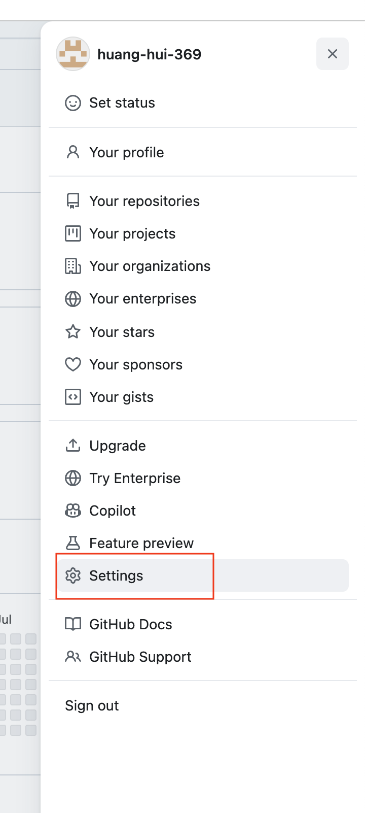
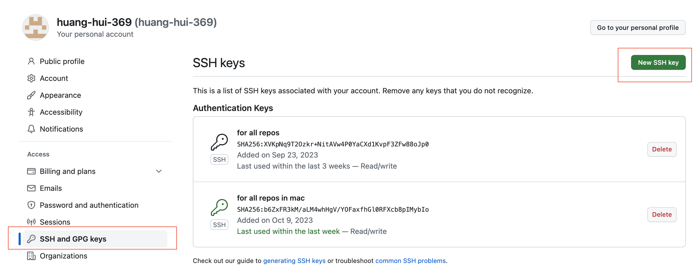
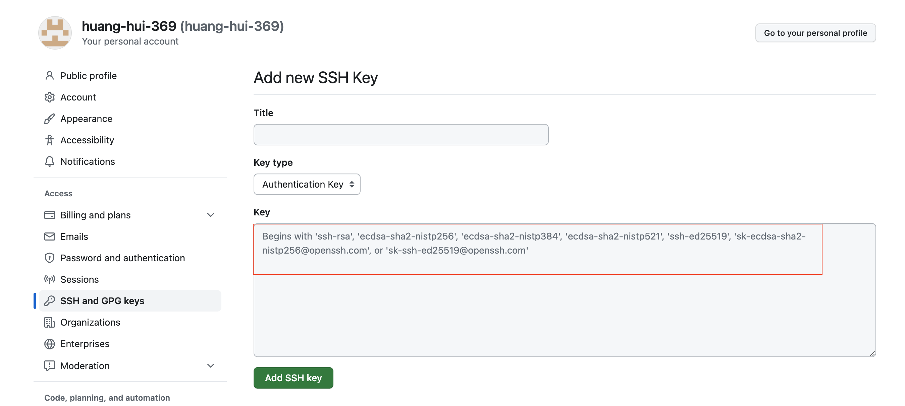

# mac

## 1. generate ssh key
```sh
   cd ~/.ssh
   ssh-keygen -t ed25519 -C "koukikouki215@hotmail.com"
```
save key as "id_rsa_github"
will generate 2 file

id_rsa_github       -- private key file
id_rsa_github.pub   -- public key file


phase Rock6688


## 2. Add the SSH key to the ssh-agent
2-1. Start the ssh-agent in the background
`eval "$(ssh-agent -s)"`

2-2. Add your SSH private key to the ssh-agent
`ssh-add --apple-use-keychain ~/.ssh/id_rsa_key_github`


2-3. Set up the config file for some convenient options

```sh
touch ~/.ssh/config

vi ~/.ssh/config

Host *.github.com
  AddKeysToAgent yes
  UseKeychain yes
  IdentityFile ~/.ssh/id_rsa_key_github

```

## 3. Add the SSH key to your Github account

3-1. Copy the content of your SSH public key
id_rsa_key_github.pub

3-2. Go to Github.com and add the copied public key content in your account settings

* Click your avatar in the upper-right corner > In the dropdown menu, click ‘Settings’


* In the user settings sidebar on the left side of the page, click ‘SSH and GPG keys’
  
* Click the green ‘New SSH key’ button


* past the content of your SSH public key and click add ssh key


## 4. clone from github

`git clone `
