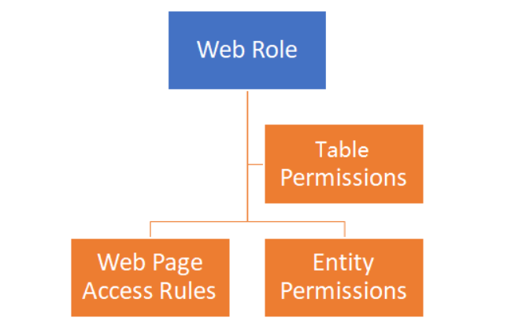

# Power Apps ポータルの機能

Power Apps ポータルを使用すると、匿名で、あるいは LinkedIn、Microsoft、Facebook、Google などの商用認証プロバイダー、または Azure AD、B2C、Okta などのエンタープライズ プロバイダーを介して、データへの安全なアクセスを内部ユーザーおよび外部ユーザーに提供できます。 

- Centralized management

- Common Data Model

- Roles and permissions

- Forms and views

- Business rules

- Declarative workflows and actions

- Plug-in architecture

- Integration with other services

- Microsoft Dataverse extensibility

- Audit

## ポータル テンプレートを選択

Dynamics 365 Sales や Dynamics 365 サービスなどの Microsoft Dynamics 365 アプリを使用している場合は、さらに次の 5 つのポータル テンプレートを選択できます。

- コミュニティ ポータル

- 顧客セルフサービス ポータル

- 従業員セルフサービス ポータル

- パートナー ポータル

- 顧客ポータル (Dynamics 365 Supply Chain Management)

## 1つMicrosoft Dataverse 環境には 1 つの Power Apps ポータルのみをプロビジョニングできます。
- ポータルの名前、
- ポータルの一意のアドレス (URL) 、
- 言語を選択します。

# ポータルのコア コンポーネント

## Web ページ

## ページ テンプレート
Think of the webpage as the exact URL and the Page template as the blueprint for displaying the content.

## コンテンツ スニペット
Content snippets are reusable fragments of editable content that can be placed within a web template. Using snippets allows for targeted editing of parts of a page without affecting the overall content.

例：header

## テーブル リストとテーブル フォーム
potal可以引入在dataverse中预先定义的テーブル リスト，和テーブル フォーム。
而且可以在テーブル リスト中，追加add，edit，view，delete action。

##  Use themes in portals

# portals security

## 認証 Authentication

- Local authentication - Basic authentication with usernames and passwords are stored in the Microsoft Dataverse contact row internally.

- External authentication - Credentials and password management are handled by other identity providers. Supported authentication providers include

    - OAuth2 (Microsoft, Twitter, Facebook, Google, LinkedIn, Yahoo)

    - Open ID (Azure Active Directory, Azure Active Directory B2C)

    - WS-Federation and SAML 2.0 (used for integration with on-premises Active Directory and other identity services)

## Authorization
After the user is authenticated and associated with a contact, Power Apps portals use numerous tables to define authorization, that is, what a user is allowed to do. Selecting Share from the portal app options will provide information on how to share the portal app with internal and external users.

**Web roles** allow an administrator to control user access to portal content and Microsoft Dataverse rows.

A web role can be associated with the following table rows:

- Website permissions - Define what (if any) front-side editing permissions that a web role should have.

- Webpage access rules - Define what pages are visible to a web role and what actions can be taken.

- Table permissions - Define what access a web role has to individual Microsoft Dataverse tables.

A portal contact might be assigned to one or more web roles at a time. Access rules and permissions of individual roles are combined to determine the resulting permissions set.

通常会至少生成两个web role
- Anonymous      匿名用户的权限
- Authenticated  signed in用户的权限

