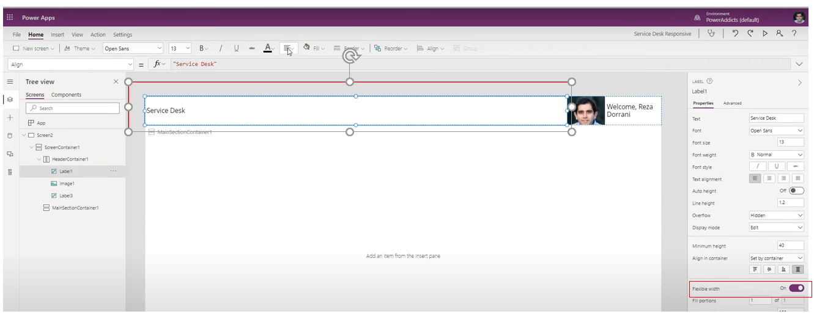
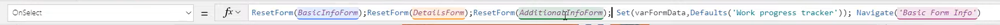

# How to build Responsive Power App＃
https://www.youtube.com/watch?v=1o2L0DADzKQ

display --> Scale to fit --> off

insert --> search container

flexable width --> 会自动按最大填充width

customize size
app --> advanced

Parent.width

# navigate form
https://www.youtube.com/watch?v=9gI9OscTLD0

迁移到指定页面

## 设置FormModel new or edit

## new，edit，view 都用同一个Form

### new
设置 FormModel 为 edit
设置 form item的数据源来源于变量,这样的话，当数据不存在时，就相当于创建了一条数据
(Form item 决定了要显示的数据的来源)
在button 按下时，设置变量 = 默认的数据源中的数据

### view
当点击view button时，设置变量 = ThisItem 来获取数据

这样没有办法区分是viewModel还是editModel
设置变量 varFromModel 来确定是viewModel还是editModel
当点击view button时，设置变量 varFromModel = FormMode.View

当点击edit，new button时 设置变量 varFromModel = FormMode.Edit

### 设置FormModel=变量

## 如果验证不通过设置button不可用

回退到前一页面

迁移前，resetForm

将三个form的数据更新到db

确认更新成功或者失败

# Power Apps form data validation 
https://www.youtube.com/watch?v=XvevCq6qhX4

# Form model
https://www.youtube.com/watch?v=BnzaSDYl8mA

# PowerApps Left Navigation Component
https://www.youtube.com/watch?v=dP74npyyvGc

# Power Apps Navigation Menu Component (2 level menu)
https://www.youtube.com/watch?v=3S0h2nODcxM

