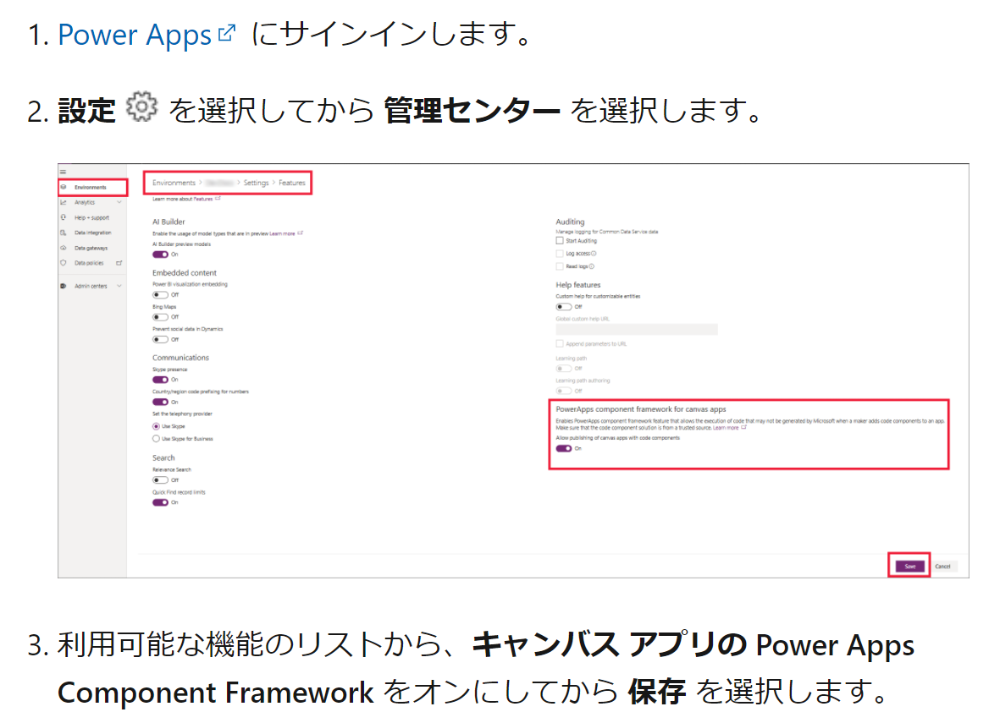

# componentの構成

3つの要素で構成されています:

- マニフェスト
- コンポーネントの実装
- リソース


## マニフェスト

- コンポーネントの名前です。
- 設定可能なデータの種類で、**field** か **dataset** のいずれかです。
- コンポーネントが追加されたときにアプリケーションで構成できる任意のプロパティ。
- コンポーネントが必要とするリソース ファイルの一覧。

https://docs.microsoft.com/ja-jp/powerapps/developer/component-framework/manifest-schema-reference/

## コンポーネントの実装
TypeScript を使用して実装されます。
オブジェクトは次のメソッドを実装します:

- init (必須)
- updateView (必須)
- getOutputs (オプション)
- destroy (必須)


### page load
```
var controlObj = new SampleNameSpace.LinearInputComponent();
controlObj.init(context,notifyOutputChanged,state,container);
```

**引数**

- **コンテキスト**
  コンポーネントの構成方法に関するすべての情報と、 Power Apps Component Framework API とともにコンポーネント内で使用できるすべてのパラメータを含みます。 たとえば、context.parameters.<"property name from manifest"> を入力プロパティへのアクセスに使用できます。

- **notifyOutputChanged**
  call back function コード コンポーネントに非同期に取得可能な新しい出力があるとフレームワークに警告します。

- state
  这是一个字典map类型，上一次通过调用 setControlState 保存的コンポーネント的状态，可以通过该参数取出。

- **コンテナ**
  開発者とアプリ メーカーが、コンポーネントを定義する UI の HTML 要素を追加することができるHTML div 要素。

### ユーザーがデータを変更する時

需要调用 call back function notifyOutputChanged
例如
```
public refreshData(evt: Event): void {
    this._value = (this.inputElement.value as any) as number;
    this.labelElement.innerHTML = this.inputElement.value;
    this._notifyOutputChanged();
}
```

### アプリがデータを変更する時
プラットフォームがデータを変更すると、コンポーネントの updateView メソッドを呼び出し。
例如
```
public updateView(context: ComponentFramework.Context<IInputs>): void {
        this._value = context.parameters.controlValue.raw!;
        this._context = context;
        this.inputElement.setAttribute("value", context.parameters.controlValue.formatted ? context.parameters.controlValue.formatted : "");
        this.labelElement.innerHTML = context.parameters.controlValue.formatted ? context.parameters.controlValue.formatted : "";
    }
```
### ページを閉じる時
Component的状态就会丢失，如果想要保存Component的状态需要实装setControlState方法
destroy メソッドが呼び出されて、資源が削除されます。


## リソース
コンポーネントのビジュアル化を実装するために必要なリソース ファイルを参照します。

# 既存のコード コンポーネントの更新
マニフェスト ファイルのバージョンのプロパティを変更する必要があります。 変更を加える際には、常にコンポーネント の バージョン を更新することを推奨します。

# Power Apps Component Framework 機能を有効にする
既定では Power Apps コンポーネント機能は、モデル駆動型アプリで有効になっています。

キャンバス アプリではPower Apps Component Framework 機能を有効にする必要があります。



# Microsoft Power Platform CLI 

# resource

https://docs.microsoft.com/ja-jp/learn/paths/use-power-apps-component-framework/
