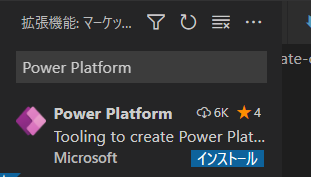

# 概念
微软的组件用的是react框架，用typescript开发
model driven组件有两种类型
1. filed 类型
2. dataset 类型

# 前提条件

## 1. Visual Studio Code (VSCode) ([パスに追加] オプションが選択されていることを確認してください)

## 2. node.js (LTS バージョンが推奨されています)
   https://nodejs.org/en/download/
   

## 3. install Microsoft Power Platform CLI (Visual Studio Code 拡張機能または MSI インストーラーのいずれかを使用します)

1. Visual Studio Code を開きます。

2. 活動 パネルから 拡張機能 アイコンを選択します。 検索バーに Power Platform拡張機能 と入力します。
   

3. インストール を選択します。 インストールが完了したら、Visual Studio Code を再起動して、ターミナル ウィンドウ内の拡張機能を表示します。

4. 下载Power Platform CLI.msi(https://aka.ms/PowerAppsCLI)

## 4. install Visual Studio 2019 少なくともワークロード .NET build tools を選択してください。
   https://visualstudio.microsoft.com/ja/downloads/

   **其实不会用到Visual Studio 2019，只是会用到所需的.NET build tools**

# 新しいコンポーネントを作成する
我们以LinearInputControl为例，来新作一个component
目录结构如下


## 1. 创建一个空的project (pcfproj) 
1. 创建folder
   ```
   mkdir LinearInputControl\LinearInputControl
   ```
2. 打开vs code
   ```
   cd LinearInputControl\LinearInputControl
   code .
   ```
3. 在vs code中打开terminal
   terminal --> new terminal
4. 创建一个空的 component project(自动生成最基本的代码框架) 
   ```
   pac pcf init --namespace SampleNamespace --name LinearInputControl --template field
   npm install    
   ```
## 2.Implement code component logic.

### 1. マニフェストの実装

完整的代码
```
<?xml version="1.0" encoding="utf-8" ?>
<manifest>
  <control namespace="SampleNamespace" constructor="LinearInputControl" version="1.1.0" display-name-key="LinearInputControl_Display_Key" description-key="LinearInputControl_Desc_Key" control-type="standard">
       <type-group name="numbers">
           <type>Whole.None</type>
           <type>Currency</type>
           <type>FP</type>
           <type>Decimal</type>
       </type-group>
       <property name="controlValue" display-name-key="controlValue_Display_Key" description-key="controlValue_Desc_Key" of-type-group="numbers" usage="bound" required="true" />
    <resources>
      <code path="index.ts" order="1" />
      <css path="css/LinearInputControl.css" order="1" />
    </resources>
  </control>
</manifest>
```
### 2. コンポーネント ロジックの実装

The object implements the following methods:

- init (Required)
- updateView (Required)
- getOutputs (Optional)
- destroy (Required)

1.  ロジックの実装
   

```
import { IInputs, IOutputs } from "./generated/ManifestTypes";

export class LinearInputControl implements ComponentFramework.StandardControl<IInputs, IOutputs> {
    private _value: number;
    private _notifyOutputChanged: () => void;
    private labelElement: HTMLLabelElement;
    private inputElement: HTMLInputElement;
    private _container: HTMLDivElement;
    private _context: ComponentFramework.Context<IInputs>;
    private _refreshData: EventListenerOrEventListenerObject;

    public init(context: ComponentFramework.Context<IInputs>, notifyOutputChanged: () => void, state: ComponentFramework.Dictionary, container: HTMLDivElement): void {
        this._context = context;
        this._container = document.createElement("div");
        this._notifyOutputChanged = notifyOutputChanged;
        this._refreshData = this.refreshData.bind(this);

        // creating HTML elements for the input type range and binding it to the function which refreshes the control data
        this.inputElement = document.createElement("input");
        this.inputElement.setAttribute("type", "range");
        this.inputElement.addEventListener("input", this._refreshData);

        //setting the max and min values for the control.
        this.inputElement.setAttribute("min", "1");
        this.inputElement.setAttribute("max", "1000");
        this.inputElement.setAttribute("class", "linearslider");
        this.inputElement.setAttribute("id", "linearrangeinput");

        // creating a HTML label element that shows the value that is set on the linear range control
        this.labelElement = document.createElement("label");
        this.labelElement.setAttribute("class", "LinearRangeLabel");
        this.labelElement.setAttribute("id", "lrclabel");

        // retrieving the latest value from the control and setting it to the HTMl elements.
        this._value = context.parameters.controlValue.raw!;
        this.inputElement.setAttribute("value", context.parameters.controlValue.formatted ? context.parameters.controlValue.formatted : "0");
        this.labelElement.innerHTML = context.parameters.controlValue.formatted ? context.parameters.controlValue.formatted : "0";

        // appending the HTML elements to the control's HTML container element.
        this._container.appendChild(this.inputElement);
        this._container.appendChild(this.labelElement);
        container.appendChild(this._container);
    }

    public refreshData(evt: Event): void {
        this._value = (this.inputElement.value as any) as number;
        this.labelElement.innerHTML = this.inputElement.value;
        this._notifyOutputChanged();
    }

    public updateView(context: ComponentFramework.Context<IInputs>): void {
        // storing the latest context from the control.
        this._value = context.parameters.controlValue.raw!;
        this._context = context;
        this.inputElement.setAttribute("value", context.parameters.controlValue.formatted ? context.parameters.controlValue.formatted : "");
        this.labelElement.innerHTML = context.parameters.controlValue.formatted ? context.parameters.controlValue.formatted : "";
    }

    public getOutputs(): IOutputs {
        return {
            controlValue: this._value
        };
    }

    public destroy(): void {
        this.inputElement.removeEventListener("input", this._refreshData);
    }
}
```

### 3. css的定义
在index.ts同级下创建css folder，再css folder下创建LinearInputControl.css文件
```
.SampleNamespace\.LinearInputControl input[type=range].linearslider {   
    margin: 1px 0;   
    background:transparent;
    -webkit-appearance:none;
    width:100%;padding:0;
    height:24px;
    -webkit-tap-highlight-color:transparent
}
.SampleNamespace\.LinearInputControl input[type=range].linearslider:focus {
    outline: none;
}
.SampleNamespace\.LinearInputControl input[type=range].linearslider::-webkit-slider-runnable-track {   
    background: #666;
    height:2px;
    cursor:pointer
}   
.SampleNamespace\.LinearInputControl input[type=range].linearslider::-webkit-slider-thumb {   
    background: #666;   
    border:0 solid #f00;
    height:24px;
    width:10px;
    border-radius:48px;
    cursor:pointer;
    opacity:1;
    -webkit-appearance:none;
    margin-top:-12px
}    
.SampleNamespace\.LinearInputControl input[type=range].linearslider::-moz-range-track {   
    background: #666;   
    height:2px;
    cursor:pointer  
}   
.SampleNamespace\.LinearInputControl input[type=range].linearslider::-moz-range-thumb {   
    background: #666;   
    border:0 solid #f00;
    height:24px;
    width:10px;
    border-radius:48px;
    cursor:pointer;
    opacity:1;
    -webkit-appearance:none;
    margin-top:-12px
}   
.SampleNamespace\.LinearInputControl input[type=range].linearslider::-ms-track {   
    background: #666;   
    height:2px;
    cursor:pointer  
}    
.SampleNamespace\.LinearInputControl input[type=range].linearslider::-ms-thumb {   
    background: #666;   
    border:0 solid #f00;
    height:24px;
    width:10px;
    border-radius:48px;
    cursor:pointer;
    opacity:1;
    -webkit-appearance:none;
}
```

## 3. build the code component 
```
npm run build
```

## 4. debug the code component
```
npm start watch
```


# 发布component到powersapp中

## コード コンポーネントのパッケージ化

### Create a solution project (cdsproj) 
```
cd solution
pac solution init --publisher-name Samples --publisher-prefix samples
```
**publisher-name と publisher-prefix の値不能和环境中既有的solution同名**

```
pac solution add-reference --path ..\LinearInputControl
```

### ソリューション プロジェクトから zip ファイルを生成する
```
msbuild /t:restore
```
Missing required tool: MSBuild.exe というエラーを受け取った場合は、 
パス環境変数に MSBuild.exe を追加する

生成されたソリューションの zip ファイルは、Solution\bin\debug フォルダーにあります。

## 生成的zip文件引入到powersapp中

### 方法一
https://docs.microsoft.com/ja-jp/powerapps/maker/data-platform/import-update-export-solutions
1. Power Apps にサインインし、左側のナビゲーションから ソリューション を選択します。

2. コマンド バーで インポート を選択します。
   

3. ソリューションのインポート ページで 参照 を選択して、インポートするソリューションが含まれている圧縮 (.zip または .cab) ファイルを見つけます。

4. 次へ を選択します。

5. ソリューションについての情報が表示されます。 既定では、詳細設定 セクションで SDK メッセージとフローがソリューションに存在する場合、それらがインポートされます。 非アクティブな状態でインポートする場合は、ソリューションに含まれる SDK メッセージとフローを有効にする オプションを解除します。

6. ソリューションに 接続参照 が含まれている場合、必要な接続を選択するように求められます。 接続がまだ存在しない場合は、新しい接続を作成します。 次へ を選択します。

7. ソリューションに 環境変数 が含まれている場合、値を入力するように求められます。 ソリューションまたはターゲット環境に値がすでに存在する場合、この画面は表示されません。

8. ターゲット環境で不足している依存関係が検出された場合、依存関係のリストが表示されます。 必要なパッケージ バージョンをターゲット環境にインポートできる環境では、依存関係を解決するためのリンクが表示されます。 リンクを選択すると、Power Platform の管理センターに移動し、アプリケーションの更新をインストールすることができます。 アプリケーションの更新が完了したら、もう一度ソリューションのインポートを開始することができます。

9. インポート を選択します。

ソリューションはバックグラウンドでインポートされ、少し時間がかかる場合があります。

公開が必要な変更をインポートした場合、それらを使用可能にする前に、カスタマイズを公開する必要があります。


### 方法二
1. create CLI 認証
```
pac auth create --url https://org3b82cd33.crm7.dynamics.com/

```


2. publish
```
pac pcf push --publisher-prefix samples
```

# 在modle driven的form的列中引入新作的组件
table-->form


在form中不能追加


转换到classic模式中可以追加


双击金额 field


点击 add control


追加后的效果