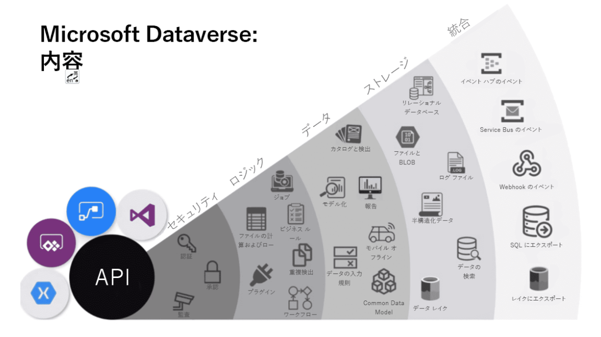

# dataverse
https://docs.microsoft.com/ja-jp/learn/modules/introduction-common-data-service/2-overview

## セキュリティ
Dataverse での認証は Azure Active Directory (Azure AD) によって処理され、条件付きアクセスと多要素認証を使用できます。 行レベルと列レベルまでの認可がサポートされ、豊富な監査機能が提供されています。

## ロジック
Dataverse を使用すると、ビジネス ロジックをデータ レベルで簡単に適用できます。 ユーザーがデータを操作する方法に関係なく、同じルールが適用されます。 重複の検出、ビジネス ルール、ワークフローなどに関連するルールを使用できます。

## データ
Dataverse を使用すると、データの整形を制御でき、データの検出、モデル化、検証、レポート作成を行うことができます。 この制御によって、使用方法にかかわらず、データを希望どおりの外観にできます。

## ストレージ
Dataverse では、物理データは Azure クラウドに格納されます。 このクラウドベースのストレージにより、データが存在する場所やスケーリング方法について心配する必要がなくなります。 これらの心配事はすべて自動的に処理されます。

## 統合: 
Dataverse の接続は、ビジネス ニーズに対応してさまざまな方法で行われます。 API、Webhook、イベント、データのエクスポートにより、データを柔軟に格納したり取得したりできます。

# table

## table 种类

### 标准
Microsoft Dataverse データベースのすべてのインスタンス用に作成されているテーブルの基本セット。 どのテーブルにも列を追加できますが、列を削除できるのはカスタム テーブルだけです。

### 自定义

## リレーションシップ
关联table 1对1 1对多

# Dataverse における環境
环境用于在 Microsoft Power Platform 中存储、管理和共享组织的业务数据、应用和流。 每个环境都允许预配一个 Microsoft Dataverse 数据库以在该环境中使用。 Microsoft Dataverse 环境允许管理用户访问权限、安全设置以及与该数据库关联的存储。
每个环境都是在 Microsoft Azure Active Directory (Azure AD) 租户下创建的，只有相应租户中的用户才能访问环境中的资源。 一个环境还会绑定到一个地理位置（例如美国）。 在环境中创建 Microsoft Dataverse 数据库时，该数据库会在该地理位置的数据中心内创建。 在该环境中创建的所有项（包括连接、网关、使用 Power Automate 的流等）也会与其环境的地理位置绑定。 

## 业务规则
在 Microsoft Dataverse 中，定义的业务规则是在数据层而不是应用层，这样的话无论在何处（所有窗体）与数据交互，它们都会生效。业务规则通常是为表而定义并应用于所有窗体（但是对画布应用有限制）

画布应用和模型驱动应用可以使用以下业务规则操作：

- 设置列值

- 清除列值

- 验证数据并显示错误信息

模型驱动应用还可以使用业务规则：

- 显示或隐藏列（仅限模型驱动应用）

- 启用或禁用列（仅限模型驱动应用）

- 创建基于商业智能的业务建议（仅限模型驱动应用）

例如：业务规则可以配置为在信用额度设置为大于 $1,000,000 时，将 Credit Limit VP Approver 字段更改为必填字段。 如果信用额度小于 $1,000,000，则该字段是可选字段。

# 管理员

Microsoft Dataverse 具有一组丰富的管理选项，可用于创建数据库的新实例，或者定制可供每个 Dataverse 数据库实例的用户使用的访问权限和功能。

## Microsoft Power Platform 管理中心

设置分组为以下几个类别，可通过选择门户左侧的链接进行访问，如下图所示。

- 环境 - 此部分列出 Microsoft Dataverse 的所有实例。

- 数据策略 - 此部分使你可以设置策略以限制可与 Microsoft Dataverse 一起使用的数据连接器，从而限制可以流入或流出 Microsoft Dataverse 表的数据。

- 数据集成 - 此部分使你可以创建或添加预定义连接，并监视 Microsoft Dataverse 与其他数据存储（如 Salesforce 或 SQL Server）之间的这些连接。

- 租户 - 此部分使你可以监视许可证和配额。

# まとめ
Microsoft Dataverse は、クラウドベースのデータ ストレージであり

## 重要な 3 つのポイントを以下に示します。
1.Microsoft Dataverse では、強力でスケーラブルなデータ ソリューションの構築を支援するために、標準のテーブル、列、リレーションシップが使用されます。
2. データを複数の論理的なチャンクに分割することにより、データが最大限に活用されるようにします。
3. Dataverse を使用すると、データをさまざまな環境に分割して、重要な情報をより適切に管理し、セキュリティで保護することができます。

# リソース
https://docs.microsoft.com/ja-jp/learn/modules/introduction-common-data-service/9-summary-resources

## view

## form
显示单条记录

### main

### card

### quickViewForm

## dashboard

## graph

## key

## command

## data

# choise（复数）

像master表，下拉框选择

# 新しいテーブル

## プライマリ名の列
pk

# table export