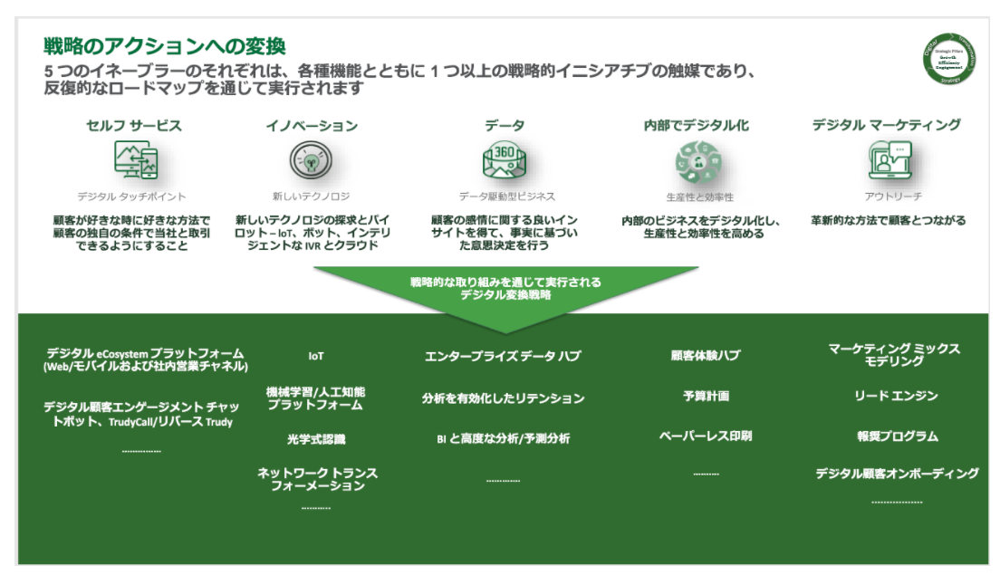

# power Automate の機能
- 1 つのシステムから別のシステムにデータを移動するといった反復タスクの自動化
- ユーザーがさまざまなステージを完了できる、プロセスを通じたユーザーの誘導
- 数百のコネクタを介した、または API を直接介した外部データソースへの接続
- ロボティック プロセス オートメーション (RPA) 機能を使用したデスクトップ ベース プロセスの自動化

# Power Automate で作成できる 3 種類のフロー

- イベント駆動型フロー - これらは、トリガーと1 つ以上のアクションで構築するフローです。 既存のコネクタのおかげで、さまざまなトリガーとアクションを利用できます。 これらは、Power Automate でマイ フローおよび Team フローとして表示されます。 マイ フローと Team フローの間で異なるのは、所有権のみです。 マイ フローでは、自分が唯一の所有者であり、Team フローには複数の所有者があります。

- ビジネス プロセス フロー- これらのフローは、モデル駆動型アプリと Microsoft Dataverse を使用する際のエクスペリエンスを増強するために構築されます。 これらの機能を使用して、モデル駆動型のアプリでガイド付きのエクスペリエンスを作成します。
  
- デスクトップ フロー- これらのロボティック プロセス オートメーション (RPA) フローを使用すると、デスクトップまたは Web ブラウザーでアクションを実行しているところを記録できます。 フローを開始してそのプロセスを実行できます。 また、データをプロセス渡したり、プロセスからデータを取得したりして、「手動」の業務プロセスを自動化できます。

# フローに人工知能を追加する
現在、構築に利用可能な AI モデルは 4 つあります。
- フォーム プロセッサ - このモデルは、アップロードした画像または撮影された写真からテキストを抽出します。
  
- 物体検出 - このモデルでは、アップロードした画像または撮影した写真から物体を識別し、その後、存在する物体の数を表示します。

- 予測 - このモデルは、以前のデータ履歴に基づいてyes または no の結果を予測するモデルを作成できます。 yes/no の結果を含む履歴データを提供することによってモデルをトレーニングします。その後、人工知能によって残りの操作が行われます。

- テキスト分類 - このモデルでは、テキストが意味別に分類されるため、分析が容易になります。

# セキュリティと管理
Microsoft Power Platform 管理センターからは、Power Automate に対する完全なアクセスとテナント全体のアクセスができます。 環境を作成および管理し、データ損失防止ポリシーを実装して、データ統合に関する作業を行い、ユーザー ライセンスとクォータを管理することができます。 管理センターには、Power Automate 全体の管理機能が用意されています。

# ビジネス バリューの推進
Power Automate フローは、トリガーとアクションを使用して作成されます。 トリガーはフローの開始を決定し、アクションは実行内容を決定します。 Power Automate では、必要な条件を決定するためのビジネス ロジックを指定することさえできます。

# 顧客ケース study - TruGreen

# さまざまなタイプのフロー

