# フロー作成の概要

Power Automate を活用して簡単なワークフローを構築し、生産性を向上して、タスクを簡略化する方法について説明します。

- テンプレートからフローを作成する
- スケジュールで繰り返しフローを作成する
- 新しいレコードまたはレコードの変更によってトリガーされるフローを作成する
- ボタンによってトリガーされるフローを作成する
- 承認要求を自動化し、承認センターを確認する
- ビジネス プロセス フローを作成する

## テンプレートからフローを作成する

Power Automate にログインして、左側のメニューから テンプレート を選択します。
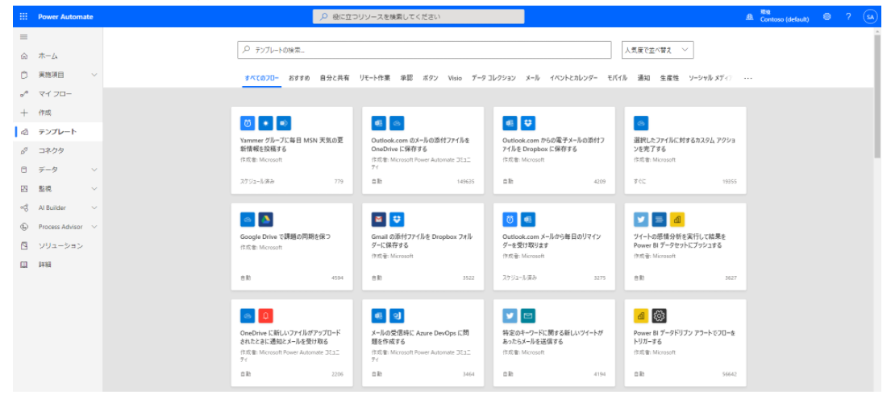

- インスタント フローは、Power Apps、フロー ボタン、またはその他の方法でのユーザー入力を必要とします。 インスタント フローを作成する場合、"メールを受信したとき" のアクションはありません。
- sharePointListに組み込み承認フローがあります。

## フローの構成
- トリガー
  トリガーは、フローの開始アクションと見なすことができます。 トリガーには、受信トレイにある新しい電子メールや、SharePoint リストへの新しい項目などがあります。

- 1 つまたは複数のアクションが含まれます。
  アクションは、トリガーが呼び出されたときに実行させるものです。 たとえば、新しい電子メール トリガーでは、OneDrive for Business で新しいファイルを作成するアクションが開始されます。 他のアクションの例には、メールの送信、ツイートの投稿、承認の開始などがあります。

## トリガーのタイプ

- 変更があった場合: これは、データが変更されたときに実行されるトリガーです。 たとえば、SharePoint で新しい品目が作成されたり、Dynamics でリードが更新されたり、イベントが Outlook から削除されたりした場合です。 前のフローは、何らかの変更があった場合に実行されるフローの一例です。

- スケジュールに従う: 1 日の特定の時刻に、繰り返しでトリガーされるフローを設定できます。 これにより、保留になっているアカウントの更新の有無を毎日午前 8 時に確認し、更新が有る場合は必要な人々にメールを送信するというプロセスが可能になります。

- ボタンを押すとき: このトリガーはさまざまな方法で具体化します。 これは、モバイル アプリでフロー仮想ボタンが実行されている場合、サード パーティのオプションを使用して物理的なボタンをクリックした場合、または、Power Apps の中でボタンを押した場合などに生じることがあります。 これにより、ユーザーはオンデマンドでのフローの「実行」を制御できます。

## アクションのタイプ
- ループ – フローの次のステップに進むために条件が満たされるまでアクションを実行します

- スイッチ – 入力の評価に基づいて実行する 1 つのケースを識別します

- Do Until – 指定した条件の評価結果が true になるまで、アクションのブロックを実行します

- 各品目に適用する – 入力配列の各品目について、アクションのブロックを実行します

- 式 – 手動での記述が可能なフロー内で実行される実際のロジックを記述した、基になる定義

# 繰り返しフローの作成

次のような特定のスケジュールで 1 つまたは複数のタスク (たとえば、メールによるレポートの送信) を実行するフローを作成できます。

- 1 日、1 時間、または 1 分ごとに 1 回

## フローを作成する

1. Power Automate を起動し、組織のアカウントを使用してサインインします。

2. 左側のウィンドウで、+ 作成 を選択します。

3. 一から開始 の下にある スケジュール済みクラウド フロー を選択します。
   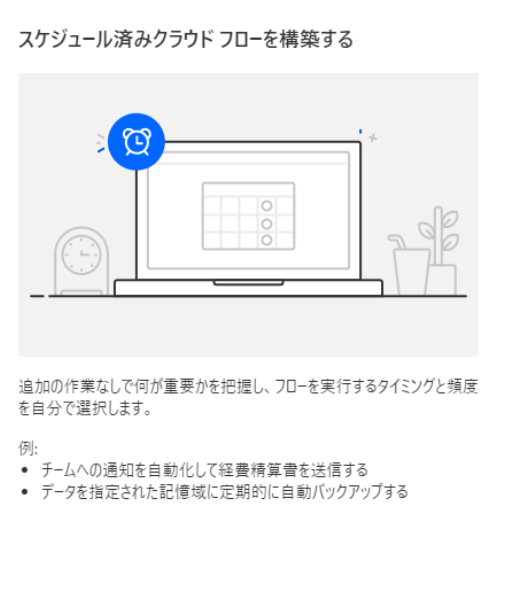

4. ダイアログ ボックスで、フロー名と、フローを実行する頻度を指定します。
   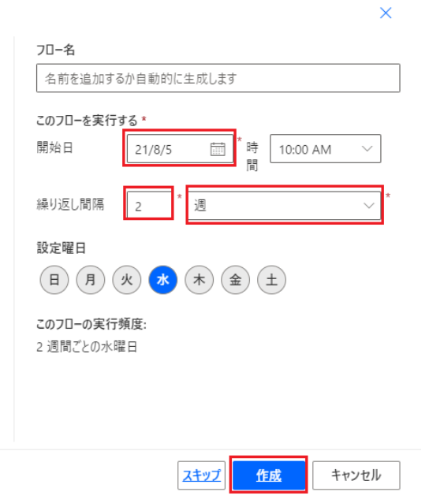

たとえば、フローを 2 週間ごとに実行する場合は、間隔 フィールドに 2 と入力し、頻度 フィールドで 週 を選択します。 フローを実行する必要のある曜日を指定することもできます。 ダイアログ ボックスの下部にあるテキストによって、平易な言葉で入力が説明されます。

5. 入力に問題がなければ、作成 を選択します。

## 詳細オプションを指定する
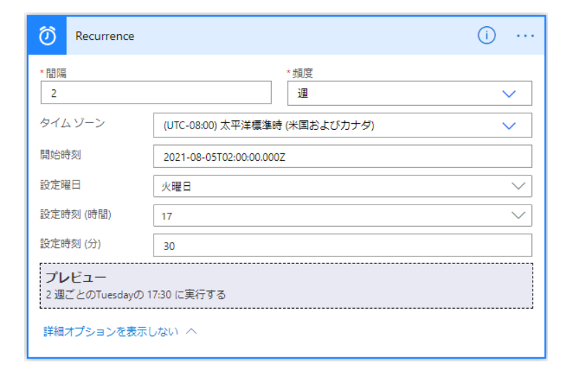

## 作成アクションの使用
フローをデザインしているときに、作成 アクションを使用して、同じデータを複数回入力しないようにします。 たとえば、フローをデザインする際に、数字の配列 [0,1,2,3,4,5,6,7,8,9] を何回か入力する必要がある場合は、作成アクションを使用して、次のような配列を保存できます。

1. 作成 を検索し、データ操作 - 作成 (データ操作) アクションを選択します。
   
   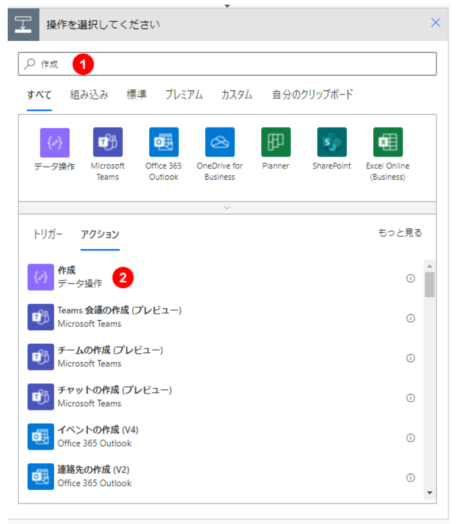

2. 後で参照する 入力 ボックスに配列を入力します。
   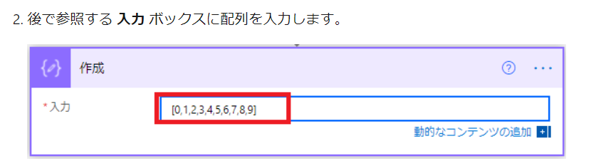

3. 必要なアクションを実行するには、引き続きフローにステップを追加します。

4. 左上の [無題] を選択し、フロー名を入力してフロー名を変更します。

5. 次に、右上隅のフローを 保存 します

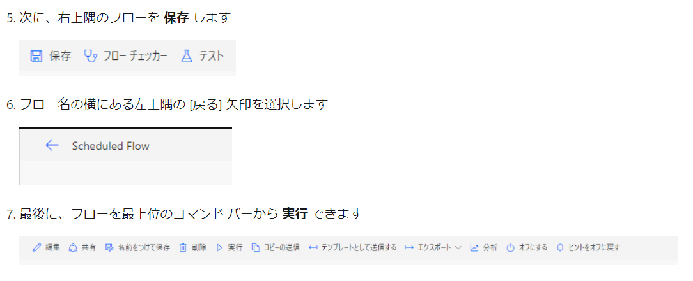

# ボタン フローを作成する
Power Automate モバイル アプリでボタン フローを作成する

例：10 分後に通知を送信するボタン テンプレートを使用します。

1. 参照 を選択します。

2. 10 分後にアラームを送信するボタン フローを選択します。
   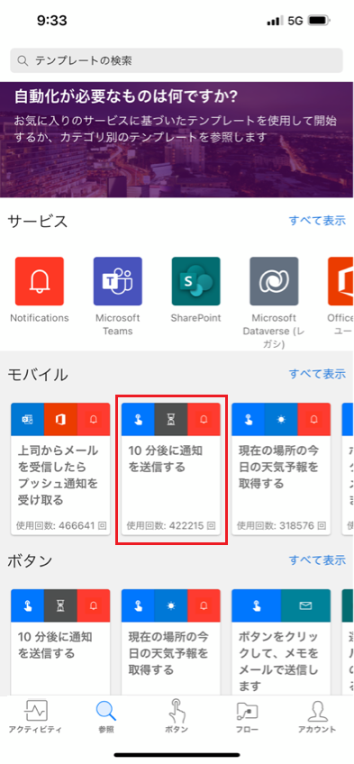

3. このテンプレートを使用 を選択します。
   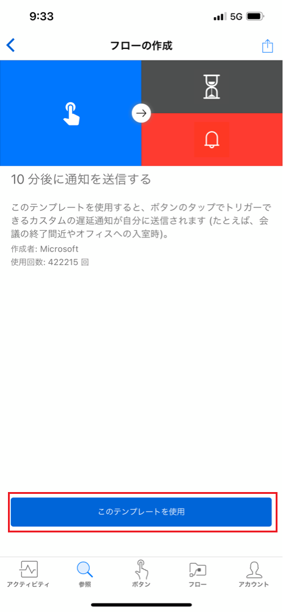

4. 作成 を選択し、完了 の順に選択しローが保存されます。
   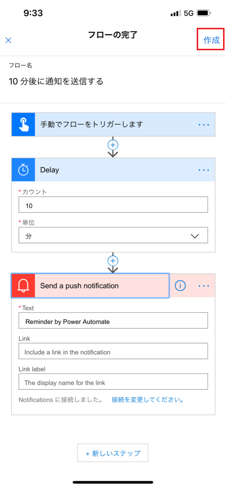
   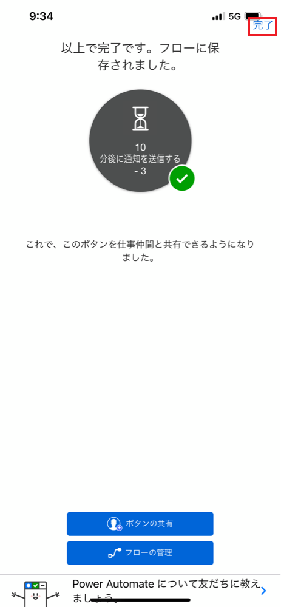

5. ボタン を選択して新しいフローを確認します
   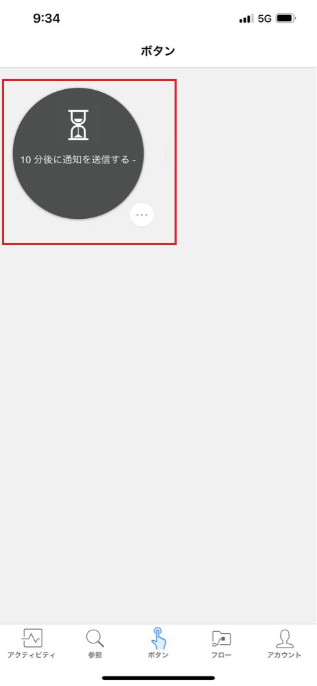

6. フローを選択します。 10 分後、アラームが届きます。

# 承認要求フローを作成する

## 例としてはやることの流れ
特定のリストで新しいアイテムが作成されるたびに、承認プロセスを開始するテンプレートを使用します。 アイテムが承認された場合、ツイートは Twitter に投稿されます。 このユニットでは、手順を追加してプロセスを変更します。その手順とは、承認応答で SharePoint リストを更新し、項目が承認されたかどうかを表示して、承認者が提示されたツイートに追加したすべてのコメントを追加することです。

# ビジネス プロセス フローの作成

# リソース

- Power Automate のドキュメント https://docs.microsoft.com/ja-jp/flow/

- Power Automate の概要 https://docs.microsoft.com/ja-jp/learn/modules/get-started-with-flow/

- Power Automateでより複雑なフローを構築する https://docs.microsoft.com/ja-jp/learn/modules/build-more-flows/
