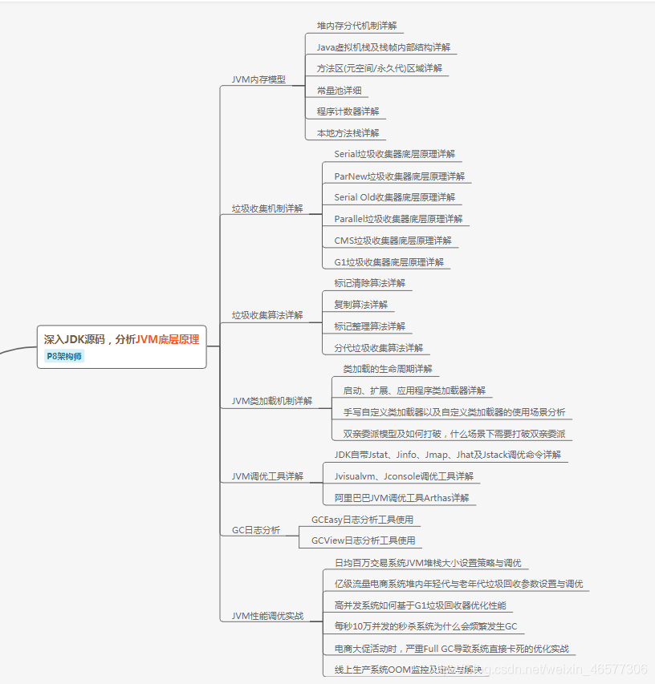
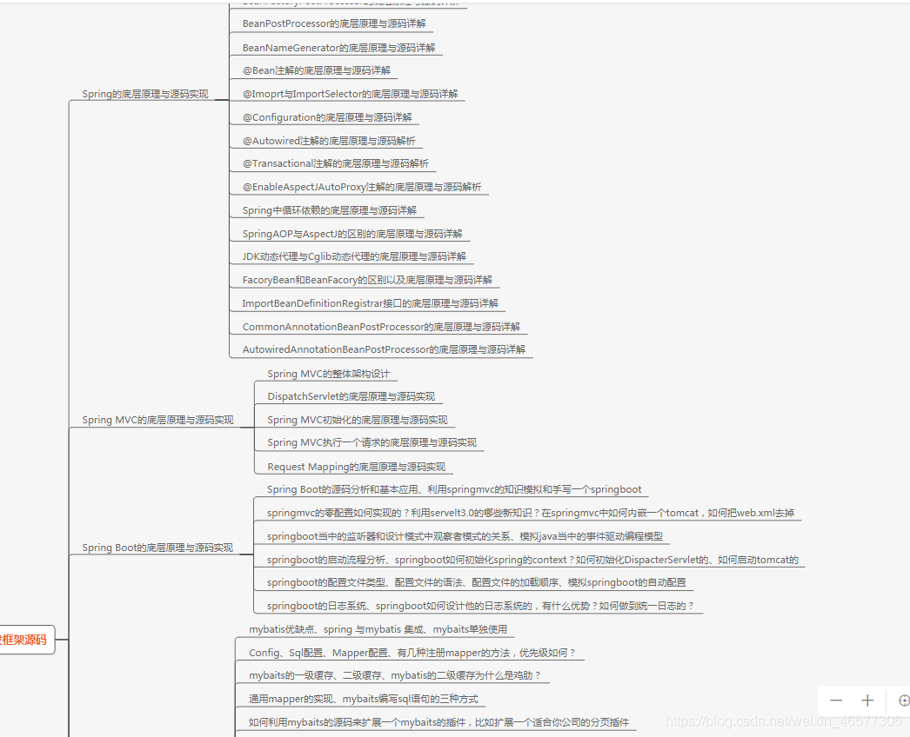
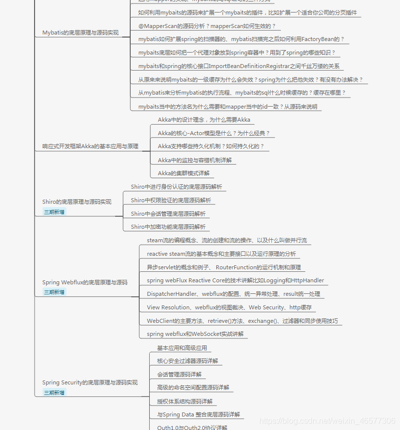
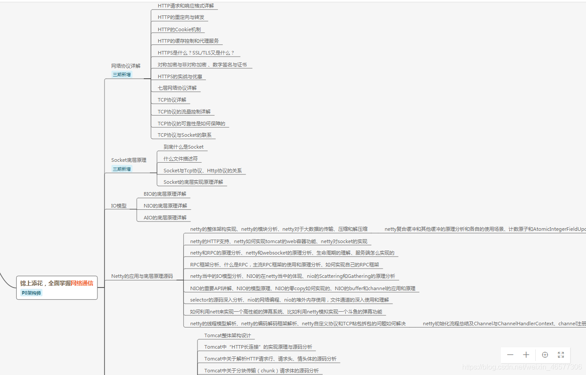
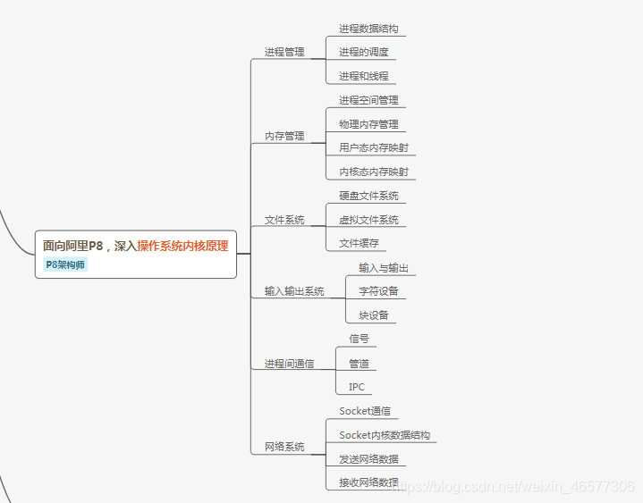
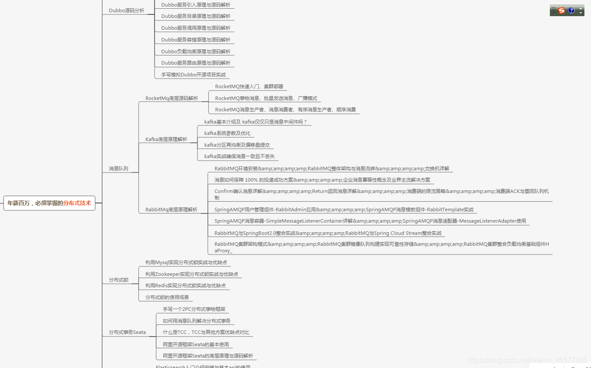
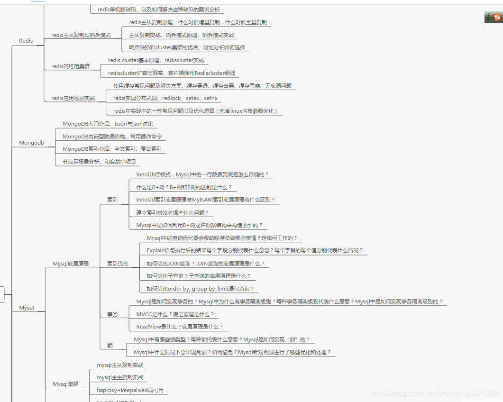
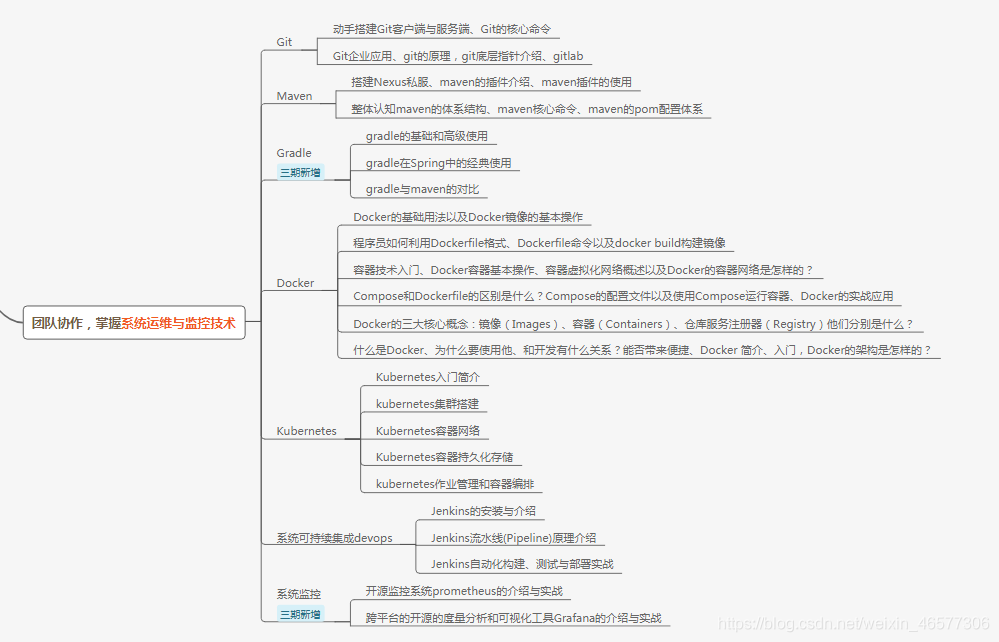
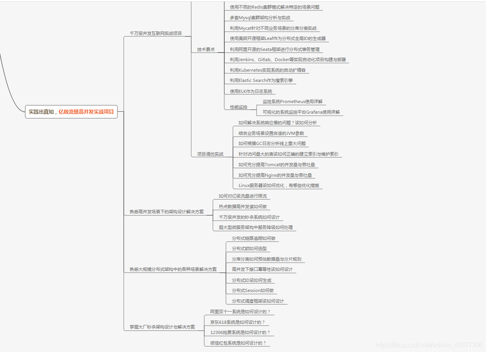

一、工程师
阶段描述

成为一个合格的工程师需要 1~3 年时间，其典型特征是“在别人的指导下完成开发”，这里的“别人”主要是“高级工程师”或者“技术专家”，通常情况下，高级工程师或者技术专家负责需求分析和讨论、方案设计，工程师负责编码实现，高级工程师或者技术专家会指导工程师进行编码实现。

成长指导

工程师阶段是最原始的“基础技能积累阶段”，主要积累基础知识，包括编程语言、编程工具、各类系统的基本使用。以 Java 后端工程师为例，工程师阶段需要积累的经验和技能有：

Java 的语法、基本数据结构的使用。

Eclipse、IDEA、Maven、Linux 命令行等各种工具。

数据库 CRUD 操作、缓存的基本使用等。

业务系统的基本流程。

工程师阶段最好的学习方法就是 找经典的书籍系统地学习，而不要遇到一个问题到网上搜搜然后就解决了事。以 Java 为例，《Java 编程思想》《Java 核心技术》《TCP/IP 协议》这类大部头，一定要完整地看一遍，即使里面很多内容当前工作暂时用不上。

二、高级工程师
阶段描述

成长为高级工程师需要 2~5 年时间，其典型特征是“独立完成开发”，包括需求分析、方案设计、编码实现，其中需求分析和方案设计已经包含了“判断”和“选择”，只是范围相对来说小一些，更多是在已有架构下进行设计。以 Java 后端工程师为例，高级工程师需要完成的工作包括：

MySQL 数据库表如何设计，是设计成两个表还是三个表？

是否要用缓存，缓存的 Key 和 Value 如何设计，缓存的更新策略是什么？

产品提出的需求是否合理？是否有更好的方式来满足？

成长指导

从普通工程师成长为高级工程师，主要需要“积累方案设计经验”，简单来说就是业务当前用到的相关技术的设计经验。以 Java 后端高级工程师为例，包括：表设计经验、缓存设计经验、业务流程设计经验、接口设计经验等。当接到一个业务需求的时候，高级工程师能够组合这些设计经验，最终完成业务需求。

高级工程师阶段相比工程师阶段，有两个典型的差异：

深度：如果说工程师是要求知道 How，那高级工程师就要求知道 Why 了。例如 Java 的各种数据结构的实现原理，因为只有深入掌握了这些实现原理，才能对其优缺点和使用场景有深刻理解，这样在做具体方案设计的时候才能选择合适的数据结构。

理论：理论就是前人总结出来的成熟的设计经验，例如数据库表设计的 3 个范式、面向对象的设计模式、SOLID 设计原则、缓存设计理论（缓存穿透、缓存雪崩、缓存热点）等。

针对技术深度，我的建议还是系统地学习，包括看书和研究源码。例如，研究 Java 虚拟机可以看《深入理解 Java 虚拟机》、研究 MySQL 可以看《MySQL 技术内幕：InnoDB 存储引擎》、研究 Memcache 可以去看其源码。

针对设计理论，由于涉及的点很多，没有一本书能够涵盖这么多的设计点，因此更多的是依靠自己去网上搜索资料学习。那我们怎么知道哪些地方会有设计理论呢？简单来说，就是假设每个设计环节都有设计理论，然后带着这种假设去搜索验证看看是否真的有很熟的设计理念。

三、技术专家
阶段描述

成长为技术专家需要 4~8 年时间，其典型的特征是“某个领域的专家”，通俗地讲，只要是这个领域的问题，技术专家都可以解决。例如：Java 开发专家、PHP 开发专家、Android 开发专家、iOS 开发专家、前端开发专家等。通常情况下，“领域”的范围不能太小，例如我们可以说“Java 开发专家”，但不会说“Java 多线程专家”或“Java JDBC 专家”。

技术专家与高级工程师的一个典型区别就是，高级工程师主要是在已有的架构框架下完成设计，而技术专家会根据需要修改、扩展、优化架构。例如，同样是 Java 开发，高级工程师关注的是如何优化 MySQL 的查询性能，而技术专家可能就会考虑引入 Elasticsearch 来完成搜索。

成长指导

从高级工程师成长为技术专家，主要需要“拓展技术宽度”，因为一个“领域”必然会涉及众多的技术面。以 Java 后端开发为例，要成为一个 Java 开发专家，需要掌握 Java 多线程、JDBC、Java 虚拟机、面向对象、设计模式、Netty、Elasticsearch、Memcache、Redis、MySQL 等众多技术。常见的拓展技术宽度的方法有：

学习业界成熟的开源方案，例如，Java 开发可以去学习 Redis、Memcache、Netty 等，Android 开发可以去研究 Retrofit、Fresco、OkHttp 等。

研究业界的经验分享，例如 BAT、FANG 等大公司的经验，可以通过参加技术大会等方式去近距离了解。

需要注意的是，拓展技术宽度并不意味着仅仅只是知道一个技术名词，而是要深入去理解每个技术的原理、优缺点、应用场景，否则就会成为传说中的“PPT 技术专家”。例如，以 Java 开发为例，知道 Netty 是个高性能网络库是远远不够的，还需要学习 Netty 的原理，以及具体如何使用 Netty 来开发高性能系统。

四、初级架构师
阶段描述

成长为初级架构师需要 5~10 年时间，其典型特征就是能够“独立完成一个系统的架构设计”，可以是从 0 到 1 设计一个新系统，也可以是将架构从 1.0 重构到 2.0。初级架构师负责的系统复杂度相对来说不高，例如后台管理系统、某个业务下的子系统、100 万 PV 量级的网站等。

初级架构师和技术专家的典型区别是：架构师是基于完善的架构设计方法论的指导来进行架构设计，而技术专家更多的是基于经验进行架构设计。简单来说，即使是同样一个方案，初级架构师能够清晰地阐述架构设计的理由和原因，而技术专家可能就是因为自己曾经这样做过，或者看到别人这样做过而选择设计方案。

但在实践工作中，技术专家和初级架构师的区别并不很明显，事实上很多技术专家其实就承担了初级架构师的角色，因为在系统复杂度相对不高的情况下，架构设计的难度不高，用不同的备选方案最终都能够较好地完成系统设计。例如，设计一个日 PV 100 万的网站，MySQL + Memcache + Spring Boot 可以很好地完成，MongoDB + Redis + Nginx + php-fpm 也可以很好地完成，备选方案设计和选择并不太难，更多的是看团队熟悉哪个技术。

成长指导

从技术专家成长为初级架构师，最主要的是形成自己的“架构设计方法论”，我的架构设计专栏其实就是讲述完整的架构设计方法论，包括架构设计目的、架构设计原则、架构设计步骤、架构设计模式等，类似的架构设计方法论还有《恰如其分的软件架构：风险驱动的设计方法》和《领域驱动设计》等。

要形成自己的架构设计方法论，主要的手段有：

系统学习架构设计方法论，包括订阅专栏或者阅读书籍等。

深入研究成熟开源系统的架构设计，这个手段在技术专家阶段也会用到，但关注点不一样，同样是研究开源系统，技术专家阶段聚焦于如何更好地应用开源项目；初级架构师阶段聚焦于学习其架构设计原理和思想，例如 Kafka 的文档中就有关于消息队列架构设计的分析和取舍。

结合架构设计方法论，分析和总结自己团队甚至公司的各种系统的架构设计优缺点，尝试思考架构重构方案。如果在这个基础上真的能够推动架构重构，那就更好了，既能够实践自己的架构设计方法论，同时积累经验，又能够展现自己的技术实力，拿到结果。

五、中级架构师
阶段描述

成长为中级架构师需要 8 年以上时间，其典型特征是“能够完成复杂系统的架构设计”，包含高性能、高可用、可扩展、海量存储等复杂系统，例如设计一个和 Kafka 性能匹敌的消息队列系统、将业务改造为异地多活、设计一个总共 100 人参与开发的业务系统等。

中级架构师与初级架构师的典型区别在于系统复杂度的不同，中级架构师面对的系统复杂度要高于初级架构师。以开源项目为例，初级架构师可能引入某个开源项目就可以完成架构设计，而中级架构师可能发现其实没有哪个开源项目是合适的，而需要自己开发一个全新的项目，事实上很多开源项目就是这样诞生出来的。

成长指导

从初级架构师成长为中级架构师，最关键的是“技术深度和技术理论的积累”，例如：

技术理论：CAP、BASE 是异地多活的设计理论基础、Paxos 是分布式一致性的基础算法、2PC、3PC 是分布式事务的基础算法等。

技术深度：Kafka 用磁盘存储还能做到高效是因为磁盘顺序写；Disruptor 高性能是结合 CPU 预读取机制、缓存行、无锁设计等基础技术；Storm 的高效异或确认机制；Flink 的分布式快照算法等。

很多同学对这点可能有疑问，这些技术理论和技术深度的事情不应该是高级工程师阶段或者技术专家阶段就应该积累的么？为何到了中级架构师阶段反而是成长的关键了呢？主要原因在于高级工程师或者技术专家阶段即使去学习这些技术，实际上也比较难理解透彻，更加难以有机会去应用，更多的时候只是了解有这个技术点而已；而到了中级架构师阶段，面对高复杂度的系统，很多时候就是几个关键技术细节决定整个架构设计的成败，或者某个设计方案理论上就是不可行的，如果不深刻理解理论和相关的关键技术点，很难设计优秀的架构。

以我做过的异地多活设计方案为例，之前很早我就知道 CAP 理论了，但也仅仅只是知道几个概念而已。真正做异地多活的时候，开始的时候还是走了不少弯路，试图做一个完美的异地多活系统，最终发现这其实是不可能的，某天突然顿悟：其实 CAP 理论已经明确指出来了这点，但最初学习 CAP 理论的时候，很难有这样深刻的理解。

六、高级架构师
阶段描述

成长为高级架构师需要 10 年以上时间，其典型特征是“创造新的架构模式”，例如：

谷歌大数据论文，创造了分布式存储架构、分布式计算 MapReduce 架构、列式存储架构，开创了大数据时代。

在有 MapReduce 分布式计算架构的背景下，Storm 又创造了流式计算架构。

在虚拟机很成熟的背景下，Docker 创造了容器化的技术潮流。

高级架构师与中级架构师相比，典型区别在于“创造性”，高级架构师能够创造新的架构模式，开创新的技术潮流。

# 深入JDK源码，分析JVM底层原理

# 深入JavaSE源码实现

# 并发编程

# 开发框架源码

# 网络通信

# 操作系统内核原理

# 布式技术

# 微服务技术

# 数据库原理与调优

# 系统运维与监控技术

# 架构思维

# 并发实战项目
