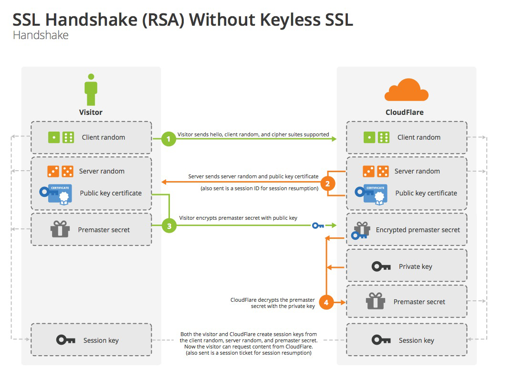

# 使用http的问题

-  窃听风险：第三方可以获知通信内容。
-  篡改风险：第三方可以修改通信内容。
-  冒充风险：第三方可以冒充他人身份参与通信。

## 解决以上问题的对策

-  窃听风险：传输内容加密，可以用对称加密算法加密通信内容。对称加密算法有DES，AES
-  篡改风险：信息摘要，hash码 = hash（通信内容内容）。hash算法有MD5,SHA256
-  冒充风险：数字签名 = 用非对称加密的私钥把hash码加密，就得到了数字签名

所以引出了在http上加一层安全传输层（ssl）后改成tls。

# https

## 基础知识

### 对称加密
对称加密，顾名思义就是加密和解密都是使用同一个密钥，常见的对称加密算法有 DES、3DES 和 AES 等，其优缺点如下：

优点：算法公开、计算量小、加密速度快、加密效率高，适合加密比较大的数据。
缺点：

因为在互联网上交易双方需要使用相同的密钥，也就无法避免密钥的传输，而密钥在传输过程中无法保证不被截获，因此对称加密的安全性得不到保证。

### 非对称加密
常见的对称加密算法有 RSA、DHE 和 ECDHE 等，
顾名思义，就是加密和解密需要使用两个不同的密钥：公钥（public key）和私钥（private key）。公钥与私钥是一对，如果用公钥对数据进行加密，只有用对应的私钥才能解密；如果用私钥对数据进行加密，那么只有用对应的公钥才能解密。非对称加密算法实现机密信息交换的基本过程是：甲方生成一对密钥并将其中的一把作为公钥对外公开；得到该公钥的乙方使用公钥对机密信息进行加密后再发送给甲方；甲方再用自己保存的私钥对加密后的信息进行解密。

优点：算法公开，加密和解密使用不同的钥匙，私钥不需要通过网络进行传输，安全性很高。
      如果能保证公钥如A声明的是A的，并且用公钥解密出内容的话，就可以确定该内容是A发出的。
缺点：计算量比较大，加密和解密速度相比对称加密慢很多。

### 一句话https就是
用非对称加密算法来交换对称加密秘钥，
用数字签名来确认身份，
用hash码来保证内容不被篡改，
然后用对称加密来加密通信内容。

## 基本流程图

## 中间人冒充劫持
距离完美还差一步
有个问题就是B网站的public key是公开的，可是你怎么确定你得到的就是B网站的public key呢。
假设A要访问taobo.com网站，结果A不小心在浏览器中输入了taobou.com，一打开和淘宝首页面显示的一模一样，这时候你得到的是taobou.com的public key，可是你根本没有觉察到，taobou.com就当了中间人冒充taobao，并将信息转发给taobao，于是你的账号不知不觉中就泄露了。

要解决这个问题
1. 面对面taobo将他的public key交给A用户，面对上亿的用户，这不现实。
2. 找一个大家都信任的机构，而且也不会因为A用户的失误，引起不安全泄露，这就引出了CA认证中心，taobao将他的public key登记到CA认证中心登记，CA认证中心来确保这个public key就是淘宝的，那又怎么确认CA认证中心的正确性呢，这就是OS，浏览器中默认安装了几家大的CA认证中心，并预先安装了这几家CA认证中心的证书，可以得到这几家CA认证中心的public key，这样的话即使用户失误了，也不会搞错。
### 认证流程
1. taobao网站生成一个private key，一个public key。
2. taobao网站访问CA认证中心的网站，（因为CA认证中心的网站的证书，默认安装在系统中，所以不会有人冒充，不会出错，全程加密，不会泄露）将自己的public key，域名信息，数字签名算法等信息生成一个网站CSR，Certificate Signing Request,即证书签名请求，上传到CA认证中心。
3. CA确认域名是taobao的（发送一段随机数给taobao，taobao将这段随机数放在网站指定目录，CA访问域名的指定目录，来确认该域名就是淘宝的。）或者，通过域名的txt记录来确认你拥有taobao域名。
4. CA确认域名后，用自己的私钥将CSR生成taobao的crt证书，并且追加hash码，防止篡改内容，最后用私钥把hash码加密，追加上数字签名，CA中心的ID，数字签名算法等信息。
5. 这样当用户访问taobao网时，就会得到经过认证的证书，浏览器，首先确认CA，然后那相应的CA的public验证数据，解密数据得到经过认证的taobao public key。

# https用到的证书概念

- **数字证书 (digital certificate)**

  在非对称加密通信过程中，服务器需要将公钥发送给客户端，在这一过程中，公钥很可能会被第三方拦截并替换，然后这个第三方就可以冒充服务器与客户端进行通信，这就是传说中的“中间人攻击”(man in the middle attack)。解决此问题的方法是通过CA认证的数字证书，数字证书一般包含以下内容：

  1. 证书所有者的公钥
  2. 证书所有者的专有名称
  3. 证书颁发机构的专有名称
  4. 证书的有效起始日期
  5. 证书的过期日期
  6. 证书数据格式的版本号
  7. 序列号，这是证书颁发机构为该证书分配的唯一标识符

  

- **数字签名 (digital signature)**

  这个概念很好理解，其实跟人的手写签名类似，是为了确保数据发送者的合法身份，也可以确保数据内容未遭到篡改，保证数据完整性。与手写签名不同的是，数字签名会随着文本数据的变化而变化。具体到数字证书的应用场景，数字签名的生成和验证流程如下：

  1. 服务器对证书内容进行信息摘要计算 (常用算法有 SHA-256等)，得到摘要信息，再用私钥把摘要信息加密，就得到了数字签名
  2. 服务器把数字证书连同数字签名一起发送给客户端
  3. 客户端用公钥解密数字签名，得到摘要信息
  4. 客户端用相同的信息摘要算法重新计算证书摘要信息，然后对这两个摘要信息进行比对，如果相同，则说明证书未被篡改，否则证书验证失败

- **证书链 (certificate chain)**

  证书链从根证书开始，并且证书链中的每一级证书所标识的实体都要为其下一级证书签名，而根证书自身则由证书颁发机构签名。客户端在验证证书链时，必须对链中所有证书的数字签名进行验证，直到达到根证书为止。

# https用到的算法suite

因为有很多的算法可以供客户端和服务器端来选择。
例如 TLS-DHE-RSA-WITH-AES-128-GCM-SHA256

交换对称加密key的算法：DHE
数字签名算法：RSA
对称加密算法：AES-128
对称加密key Mode：GCM
数字摘要（hash）: SHA256

## RSA交换对称加密key的握手流程

TLS-RSA-RSA-WITH-AES-128-GCM-SHA256
也可以写成 TLS-RSA-WITH-AES-128-GCM-SHA256

因为RSA交换流程中，客户端的随机数，服务器端的随机数，都是以明文的形式发送的，
只有第三个随机数是加密的，而且对称加密key是通过这三个随机数来生成的，是安全的，
但是随着电脑的速度的不断提升，还是有一定的安全隐患，

所以有了下面改进的DHE交换流程

## DHE交换对称加密key的握手流程

TLS-DHE-RSA-WITH-AES-128-GCM-SHA256

与RSA的区别为

- RSA client端会把Premaster secret通过网络传递给server端
- DHE client端不会发送Premaster secret给server端，而是先接受从server端发送的一个server DH parameter，然后在再发送一个client DH parameter到Server端，双方根据server DH parameter和client DH parameter来算出一个共同的Premaster secret。

# 参考文档

https://zhuanlan.zhihu.com/p/36981565
http://www.ruanyifeng.com/blog/2014/09/illustration-ssl.html
https://segmentfault.com/a/1190000021559557
