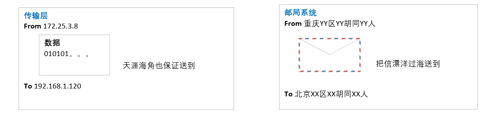

# 五层协议

- 应用层
- 传输层
- 网络层
- 数据链路层
- 物理层
  
其实传输数据，就想邮局系统寄信一样。

## 应用层
想web应用，数据库应用，还有自定定义的应用。。。
主要是定义应用层的数据意义，简单说就是定义两台机器之间，或者人与人之间能明白的数据，就是说人话。例如http协议。
就像我们写信的内容。
我们发送数据，需要知道IP，port，然后就是应用数据。和写信一样，我们需要知道对方的门牌号码，然后写信的内容

## 传输层
就是将应用层定义好的数据，传送到对方手中。
因为应用层定义的数据有可能很大，网络又很拥挤，也有可能丢失，这层的功能就是将大的数据分组，编号，如果丢失，重新发送，总之就是确保数据准确无误的到达对方手中。
其实就像邮局系统，是用来确保信可以送到对方手中。

## 网络层
网络层定义了一个IP协议，还有Mac地址。
就像邮局系统一样，得预先定义出门牌号码，街道，城市，国家。
网络就像邮寄的铁路网，公路网。

## 数据链路层
就是一条具体的线路，就像邮局的最后一公里路一样。
就是通过mac可以找到一条具体的线路，将数据传送到对方手中。

## 物理层
两台设备想要通信必须要有物理链接，可以是光缆、电缆、双绞线、无线电波。中间传的是电信号，即010101...这些二进制位。
物理层就是用来传输二进制数据的，至于数据是什么，有什么意义，它一概不管。

# 具体的传送过程
1. 应用程序写好数据，写好IP，PORT，发送数据。
2. 操作系统通过传输层程序，将发送数据分割成小包，排上序号。
3. 网络层程序首先判断是否可以找到对方机器的Mac，

# 包头数据