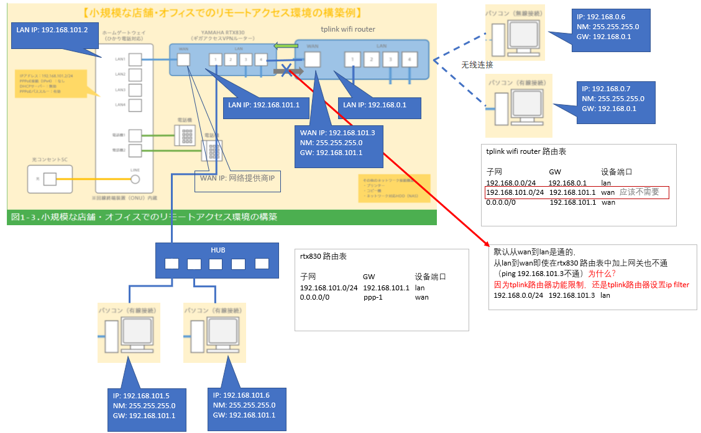

# 设置图如下
通过例如ntt，kddi，yahoo提供的homegateway装置通过pppoe连接internet，同时可以连接光电话，然后将homegateway连接到rtx830路由器的wan口上。其本质就是将homegateway当做一个pppoe桥接，实际是用rtx830当做router用。

路由器一般会有一个wan口，多个lan口 相当于有两个网卡，一个wan用，一个lan用
需要设置两个IP地址，多个lan口之间的电脑是同一个网络的话，就直接通过链路层通信。

# homegateway的设定

1. 将homegateway的lan1口接到RTX830 router的wan口
2. homegateway的设定
   - lan ip ： 192.168.101.2
   - dhcp : 无效
   - PPPoEパススルー（birdge） : 有效

lan ip和网段可以随便设置，只要和rtx830路由器的lan在同一个网段就可以。

# rtx830路由器设置

## 1. 设置lan ip ： 192.168.101.1
## 2. DHCPの設定
1. ログイン後、ダッシュボードの上に表示されている「詳細設定」をクリックします。
2. 左側のメニューから「DHCPサーバー」をクリックします。
3. DHCPサーバー機能を有効にして

## 3. internet 接线设定
1. ログイン後、ダッシュボードの上に表示されている「かんたん設定」をクリックします。
2. 「プロバイダー接続」のアイコンをクリックします。
3. 「新規」をクリックします。
4. 接続インターフェースで「WAN」を選択して「次へ」をクリックします。
5. RTX830のブロードバンド回線自動判別機能が動作して、「PPPoE接続が利用可能です。」と表示されています。次画面へ進みます。
6. 接続種別が「PPPoE接続」になっていることを確認して「次へ」をクリックします。
7. プロバイダーから発行された情報をもとに、ユーザーIDと接続パスワードを入力して「次へ」をクリックします。
8. DNSサーバーはプロバイダーから自動取得を選択して「次へ」をクリックします。
9. IPフィルターの設定で「推奨のIPフィルターを設定する」にチェックをつけて「次へ」をクリックします。推奨のIPフィルターとは次の通りです。
   - LAN側から開始するセッションは双方向で通信を許可する。
   - ICMP以外のWAN側から開始するセッションを遮断する。
   - LAN側と同じネットワークアドレスに偽装した通信を遮断する。
   - Windowsファイル共有の通信を遮断する。

   由此可以推断tplink也会阻断从wan侧到lan侧的通信。

10. 設定内容を確認して「設定の確定」をクリックします。
    プロバイダー接続の設定が完了すると「設定を変更しました。」というメッセージが表示されます。設定の一覧で、接続が正しく行われている（接続を示す緑色の矢印が表示される）ことを確認します。以上で、プロバイダー接続の設定は完了です。

# tplink路由器设置
只需要如下设置wan口
- lan ip ： 192.168.101.3
- net mask: 255.255.255.0
- gw: 192.168.101.1

# 总结

从tplink 路由器的192.168.0.0/24网段的电脑到rtx830路由器的192.168.101.0/24的网段的电脑是可以通信的。
如果不通的话，可以查看电脑的防火墙的问题。

反过来从rtx830 路由器192.168.101.0/24的网段的电脑到tplink 路由器的192.168.0.0/24网段的电脑是不通的。
需要设置tplink 路由器ip filter。

# vpn 设置

# ip filter

# vlan

# nat

