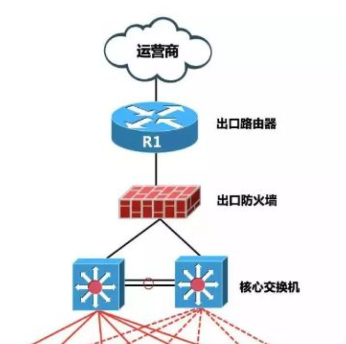

# 概念

如下是一个基本的路由器，防火墙，交换机配置图

## 路由器
路由器也被称为网关设备，它通常被用来路由不同网络之间的数据包，也会根据信道的情况自动选择和设定路由，并将您的网络与Internet连接起来。事实上，互联网是由成千上万个路由器组成的。

路由器检查每个数据包的源IP地址和目的IP地址，并在IP路由表中查找数据包的目的地，再一遍又一遍地将数据包路由到另一个路由器或交换机上，直到到达目的IP地址并作出回应。当有多种方式都可以到达目的IP地址时，路由器可以巧妙地选择最经济快捷的方式。当路由表中没有列出报文的目的地时，报文将被发送到默认路由器（如果有的话），如果数据包没有目的地，它将被丢弃。

路由器在不同的网络之间进行转换。除了最常用的以太网，还有许多其他不同的网络，如ATM和令牌环网。网络会以不同的方法封装数据，因此它们不能直接通信，而路由器可以从不同的网络“转换”这些数据包，以便不同网络之间能够更有效地传输数据。

路由器可以减少网络混乱。若没有路由器，广播将转发到每个设备的每个端口，并由每个设备处理。当广播数量太大时，整个网络都会比较混乱，这时候路由器将网络细分为两个或多个由其连接的较小的网络，并且不允许广播在子网之间传输。

## 交换机
在局域网（LAN）中，交换机类似于城市中的立交桥，它的主要功能是桥接其他网络设备（路由器、防火墙和无线接入点），并连接客户端设备（计算机、服务器、网络摄像机和IP打印机）。

一般是数据链路层的网络连接，通常通过mac地址来连接，也叫l2 switch

### 交换机的工作原理

MAC地址通常由网卡（NIC）决定，并且每个网卡、交换机和路由器的每个端口都有唯一的MAC地址。交换机从数据帧中查找源MAC和目的MAC，并将在某个交换机端口上看到的MAC地址保存在表中。如果接收到表中没有目的MAC地址，则会将帧泛洪到所有的交换机端口，这个过程被称为广播。当接收到响应时，则会将MAC地址放在表中，下一次不再泛洪。

## 防火墙

防火墙也被称为防护墙，它是一种位于内部网络与外部网络之间的网络安全系统，可以将内部网络和外部网络隔离。通常，防火墙可以保护内部/私有局域网免受外部攻击，并防止重要数据泄露。在没有防火墙的情况下，路由器会在内部网络和外部网络之间盲目传递流量且没有过滤机制，而防火墙不仅能够监控流量，还能够阻止未经授权的流量。

# 术语

## NAT
net address translate

## DMZ
DMZ是英文“demilitarized zone”的缩写，中文名称为“隔离区”，也称“非军事化区”。它是为了解决安装防火墙后外部网络不能访问内部网络服务器的问题，而设立的一个非安全系统与安全系统之间的缓冲区，这个缓冲区位于企业内部网络和外部网络之间的小网络区域内，在这个小网络区域内可以放置一些必须公开的服务器设施，如企业Web服务器、FTP服务器和论坛等。另一方面，通过这样一个DMZ区域，更加有效地保护了内部网络，因为这种网络部署，比起一般的防火墙方案，对攻击者来说又多了一道关卡。

# 一般组网案例

## 一个防火墙设置

## 两个防火墙

## 两个防火墙的应用

### 概念

在一个用路由器连接的局域网中,我们可以将网络划分为三个区域：
- 安全级别最高的LAN Area（内网）,
- 安全级别中等的DMZ区域
- 安全级别最低的Internet区域（外网）
三个区域因担负不同的任务而拥有不同的访问策略。我们在配置一个拥有DMZ区的网络的时候通常定义以下的访问控制策略以实现DMZ区的屏障功能。 

1. 内网可以访问外网
内网的用户显然需要自由地访问外网。在这一策略中，防火墙需要进行源地址转换。
2. 内网可以访问DMZ
此策略是为了方便内网用户使用和管理DMZ中的服务器。
3. 外网不能访问内网
很显然，内网中存放的是公司内部数据，这些数据不允许外网的用户进行访问。
4. 外网可以访问DMZ
DMZ中的服务器本身就是要给外界提供服务的，所以外网必须可以访问DMZ。同时，外网访问DMZ需要由防火墙完成对外地址到服务器实际地址的转换。
5. DMZ访问内网有限制
很明显，如果违背此策略，则当入侵者攻陷DMZ时，就可以进一步进攻到内网的重要数据。
6. DMZ不能访问外网

此条策略也有例外，比如DMZ中放置邮件服务器时，就需要访问外网，否则将不能正常工作。在网络中，非军事区(DMZ)是指为不信任系统提供服务的孤立网段，其目的是把敏感的内部网络和其他提供访问服务的网络分开，阻止内网和外网直接通信，以保证内网安全。

在没有DMZ的技术之前，需要使用外网服务器的用户必须在其防火墙上面开放端口（就是Port Forwarding技术）使互联网的用户访问其外网服务器，显然，这种做法会因为防火墙对互联网开放了一些必要的端口降低了需要受严密保护的内网区域的安全性，黑客们只需要攻陷外网服务器，那么整个内部网络就完全崩溃了。DMZ区的诞生恰恰为需用架设外网服务器的用户解决了内部网络的安全性问题。

### 服务配置

1、DMZ提供的服务是经过了网络地址转换（NAT）和受安全规则限制的，以达到隐蔽真实地址、控制访问的功能。首先要根据将要提供的服务和安全策略建立一个清晰的网络拓扑，确定DMZ区应用服务器的IP和端口号以及数据流向。通常网络通信流向为禁止外网区与内网区直接通信，DMZ区既可与外网区进行通信，也可以与内网区进行通信，受安全规则限制。
地址转换

2、DMZ区服务器与内网区、外网区的通信是经过网络地址转换（NAT）实现的。网络地址转换用于将一个地址域（如专用Internet）映射到另一个地址域（如Internet），以达到隐藏专用网络的目的。DMZ区服务器对内服务时映射成内网地址，对外服务时映射成外网地址。采用静态映射配置网络地址转换时，服务用IP和真实IP要一一映射，源地址转换和目的地址转换都必须要有

### DMZ安全规则制定
安全规则集是安全策略的技术实现，一个可靠、高效的安全规则集是实现一个成功、安全的防火墙的非常关键的一步。如果防火墙规则集配置错误，再好的防火墙也只是摆设。在建立规则集时必须注意规则次序，因为防火墙大多以顺序方式检查信息包，同样的规则，以不同的次序放置，可能会完全改变防火墙的运转情况。如果信息包经过每一条规则而没有发现匹配，这个信息包便会被拒绝。一般来说，通常的顺序是，较特殊的规则在前，较普通的规则在后，防止在找到一个特殊规则之前一个普通规则便被匹配，避免防火墙被配置错误。
DMZ安全规则指定了非军事区内的某一主机（IP地址）对应的安全策略。由于DMZ区内放置的服务器主机将提供公共服务，其地址是公开的，可以被外部网的用户访问，所以正确设置DMZ区安全规则对保证网络安全是十分重要的。
FireWall可以根据数据包的地址、协议和端口进行访问控制。它将每个连接作为一个数据流，通过规则表与连接表共同配合，对网络连接和会话的当前状态进行分析和监控。其用于过滤和监控的IP包信息主要有：源IP地址、目的IP地址、协议类型（IP、ICMP、TCP、UDP）、源TCP/UDP端口、目的TCP/UDP端口、ICMP报文类型域和代码域、碎片包和其他标志位（如SYN、ACK位）等。
为了让DMZ区的应用服务器能与内网中DB服务器（服务端口4004、使用TCP协议）通信，需增加DMZ区安全规则， 这样一个基于DMZ的安全应用服务便配置好了。其他的应用服务可根据安全策略逐个配置。
DMZ无疑是网络安全防御体系中重要组成部分，再加上入侵检测和基于主机的其他安全措施，将极大地提高公共服务及整个系统的安全性。